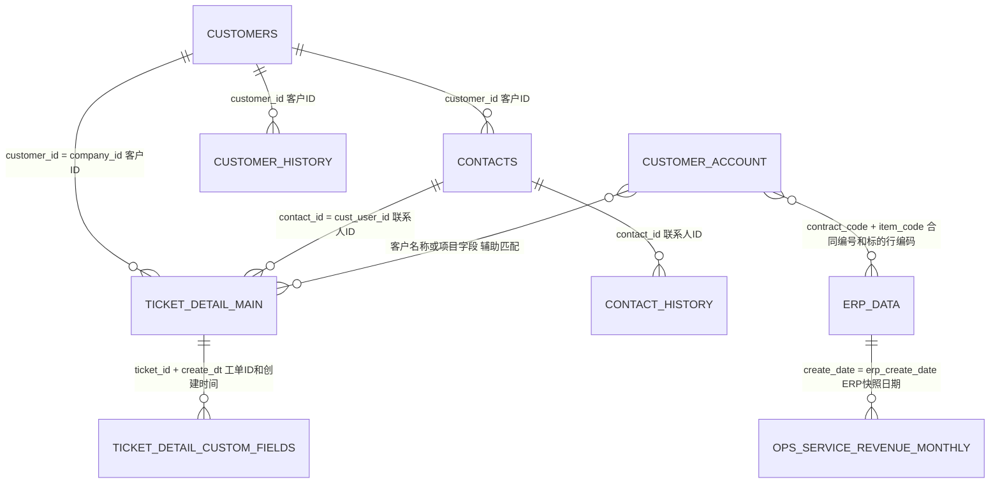

# work_order_datalake 数据库设计与使用说明

本文档说明当前项目实际维护的 MySQL 表、逻辑关联、快照规则和常用查询。
建表定义以 `src/work_order_process/mysql_storage.py` 与 `sql/*.sql` 为准。

## 1. 数据域和表

| 数据域 | 表或视图 | 主键 | 用途 |
|---|---|---|---|
| 工单 | `ticket_detail_main` | `(ticket_id, create_dt)` | 一行一张工单，保存核心字段和常用分析维度 |
| 工单 | `ticket_detail_custom_fields` | `(id, create_dt)` | 工单动态自定义字段明细 |
| 客户 | `customers` | `customer_id` | 当前客户主数据 |
| 客户 | `customer_history` | `(customer_id, version_no)` | 客户历史版本 |
| 联系人 | `contacts` | `contact_id` | 当前联系人主数据 |
| 联系人 | `contact_history` | `(contact_id, version_no)` | 联系人历史版本 |
| 联系人 | `customer_contact_relation_history` | `(contact_id, version_no)` | 联系人与客户关系历史 |
| API 审计 | `api_sync_batch` | `sync_batch_id` | API 同步批次 |
| API 审计 | `api_raw_record` | `id` | 原始接口记录 |
| 运行日志 | `sync_task_log` | `id` | 工单、客户和联系人任务结果 |
| 人员 | `personnel` | `employee_no` | 本地人员花名册 |
| 台账 | `customer_account` | `(id, create_date)` | 客户台账每日快照 |
| ERP | `erp_data` | `(id, create_date)` | 新旧 ERP 合并后的每日快照 |
| 营收 | `ops_service_revenue_monthly` | `(stat_year, stat_month, sales_platform)` | 月度营收指标 |
| 分析视图 | `v_customer_service_overview` | 无 | 客户与工单汇总 |
| 分析视图 | `v_contact_service_overview` | 无 | 联系人与工单汇总 |
| 分析视图 | `v_customer_data_quality` | 无 | 客户和联系人关联质量 |
| 营收视图 | `v_ops_service_revenue_monthly_with_total` | 无 | 月度明细加合计行 |

## 2. 主键设置

`ticket_detail_main` 使用 `(ticket_id, create_dt)`，因为它按 `create_dt`
分区，MySQL 要求分区键包含在唯一键中。业务查询只有 `ticket_id` 时仍能查到数据，
但不能有效裁剪时间分区；已知时间范围时应同时限制 `create_dt`。

`ticket_detail_custom_fields` 同样把 `create_dt` 放入主键，并通过
`(ticket_id, field_order, create_dt)` 唯一键防止同一工单的同一字段重复。

`customer_account` 和 `erp_data` 是快照表。自增 `id` 解决单次快照内的行标识，
`create_date` 同时作为分区键和快照日期。ERP 另以
`(contract_id, item_code, exec_detail_id, create_date)` 保证业务行在同一快照内唯一。

`ops_service_revenue_monthly` 的一行含义是“某年、某月、某营销平台”，因此三个字段
直接组成自然主键。同月重算采用整月替换，不能残留已从目标文件中删除的平台。

## 3. 逻辑关联

数据库没有为分区事实表强制建立外键，关联由稳定 ID、业务键和快照日期保证。



工单与客户、联系人优先使用源系统 ID 关联。台账与 ERP 优先使用
`contract_code = contract_id` 和 `item_code`；只有来源缺少稳定 ID 时才使用规范化后的
客户名称、项目名称等辅助字段，并应单独统计未匹配和一对多结果。

## 4. ERP 快照加工

输入为项目约定的新 ERP 和旧 ERP 工作簿。`merge_erp_data.py` 调用
`work_order_process.erp_merge` 完成列映射、清洗、合并和年度分摊，再由
`erp_import.py` 写入数据库。

主要规则：

- 空白及 `/` 可按规则转为空值或金额零；非空且不能解析的数值直接报错并指出字段和行。
- `sales_platform` 和 `system_engineer` 使用
  `config/erp_merge_rules.toml` 的唯一映射来源。
- 统计年度默认取运行年份，也可使用 `--statistics-year` 指定。
- `contract_days` 为运维开始、结束日期的含首尾天数。
- `prev_year_calc_amort`、`cur_year_calc_amort` 按合同区间与统计年度重叠天数分摊。
- 倒签调整遵循“今年加去年、去年减今年”，结果分别写入
  `prev_year_adjusted_amort` 和 `cur_year_adjusted_amort`。
- 导入先写连接级临时表，校验日期、行数、业务键及分摊字段，再在事务内替换同日快照。
- 发布成功后再从数据库导出单 Sheet 文档版 Excel，确保导出内容与数据库一致。

查询某个 ERP 快照：

```sql
SELECT *
FROM erp_data
WHERE create_date = '20260717'
ORDER BY seq_no, id;
```

检查快照行数、业务键重复和分摊空值：

```sql
SELECT
    create_date,
    COUNT(*) AS row_count,
    COUNT(DISTINCT contract_id, item_code, exec_detail_id) AS unique_row_count,
    SUM(prev_year_adjusted_amort IS NULL) AS prev_amort_null_count,
    SUM(cur_year_adjusted_amort IS NULL) AS cur_amort_null_count
FROM erp_data
WHERE create_date = '20260717'
GROUP BY create_date;
```

## 5. 月度营收加工

营收表只纳入目标工作簿中配置了目标的营销平台。ERP 基础有效条件为：

```text
is_public_cloud = 否
contract_category = 运维合同
other_business_type = 非税票据
invalid_contract_type = 有效
```

指标规则：

| 指标 | 计算 |
|---|---|
| 收入目标值 | 目标工作簿指定年月、营销平台的目标 |
| 确收完成值 | 基础有效条件下汇总 `cur_year_revenue`，允许暂估 |
| 不含暂估确收值 | 基础有效条件且 `is_estimated_ops = 否`，汇总 `cur_year_revenue` |
| 去年同期确收值 | 同上，汇总 `prev_year_revenue` |
| 在手合同额 | 非暂估有效合同且申请日期早于当年年初，汇总 `cur_year_adjusted_amort` |
| 去年同期在手合同额 | 非暂估有效合同且申请日期早于去年年初，汇总 `prev_year_adjusted_amort` |
| 签约完成值 | 非暂估有效合同且申请日期位于当年年初至统计月末，汇总 `product_amount` |
| 去年同期签约值 | 非暂估有效合同且申请日期位于去年同期区间，汇总 `product_amount` |
| 完成率 | 完成值 / 目标值；分母为零时为 NULL |
| 同比增长值 | 当期值 - 去年同期值 |
| 同比增长率 | 同比增长值 / 去年同期值；分母为零时为 NULL |

所有金额使用 `ROUND(..., 0)` 和 `ROUND_HALF_UP` 保留整数。生成前必须确认 ERP
快照存在、两列调整后分摊没有 NULL、聚合结果不是全空；写库时整月替换。

查询月度明细：

```sql
SELECT *
FROM ops_service_revenue_monthly
WHERE stat_year = 2026 AND stat_month = 6
ORDER BY sales_platform;
```

查询带合计行结果：

```sql
SELECT *
FROM v_ops_service_revenue_monthly_with_total
WHERE stat_year = 2026 AND stat_month = 6
ORDER BY sort_order, sales_platform;
```

## 6. 单表和关联查询

按月统计工单量：

```sql
SELECT create_month_label, COUNT(*) AS ticket_count
FROM ticket_detail_main
WHERE create_dt >= '2026-01-01' AND create_dt < '2027-01-01'
GROUP BY create_month_label
ORDER BY create_month_label;
```

查询工单及其客户、联系人：

```sql
SELECT
    t.ticket_id,
    t.subject,
    c.customer_name,
    p.contact_name,
    t.create_dt,
    t.ticket_status
FROM ticket_detail_main AS t
LEFT JOIN customers AS c ON c.customer_id = t.company_id
LEFT JOIN contacts AS p ON p.contact_id = t.cust_user_id
WHERE t.create_dt >= '2026-06-01' AND t.create_dt < '2026-07-01';
```

按合同和标的行关联同日台账、ERP：

```sql
SELECT
    a.create_date,
    a.contract_code,
    a.item_code,
    a.final_user_customer,
    e.product_amount,
    e.cur_year_adjusted_amort,
    e.sales_platform
FROM customer_account AS a
LEFT JOIN erp_data AS e
  ON e.contract_id = a.contract_code
 AND e.item_code = a.item_code
 AND e.create_date = a.create_date
WHERE a.create_date = '20260717';
```

检查最近任务失败：

```sql
SELECT id, task_type, target_month_label, status, failed_count, message, created_at
FROM sync_task_log
WHERE status <> 'success'
ORDER BY id DESC
LIMIT 50;
```

## 7. 使用约束

- 业务查询必须明确快照日期或时间范围，避免跨快照重复汇总。
- 金额汇总使用 `DECIMAL`，不要转成浮点数。
- 名称关联不是稳定主键；必须保留未匹配、一对多和人工修正记录。
- 批量写入前先校验，发布阶段使用事务；失败时保留原快照。
- 生产环境配置、日志、备份和恢复流程见
  [生产运行说明](production_operations.md)。
