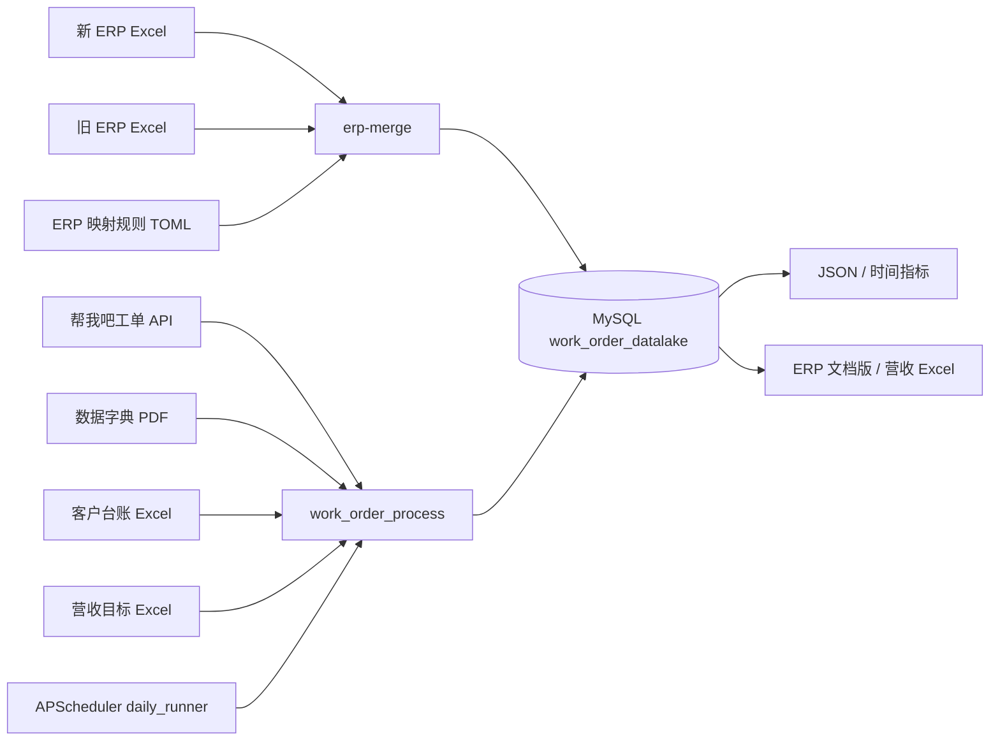
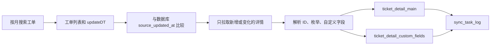
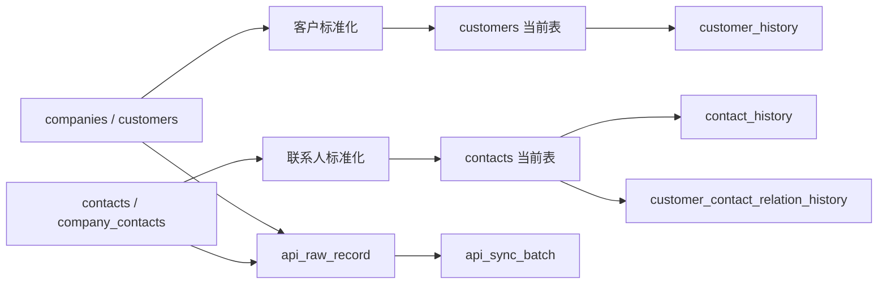
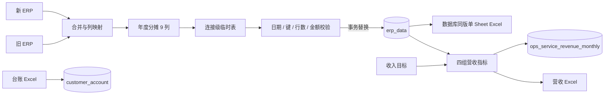

# work_order_process 项目接手手册

> 面向第一次接手本项目的开发人员。最后按代码提交 `25858ff` 核对，手册维护机制从
> `9ad5351` 开始。数据库字段和专项业务规则以本文链接的专题文档为准。

## 1. 快速接手

### 1.1 项目是做什么的

本项目把三类业务数据归集到 MySQL 数据库 `work_order_datalake`：

1. **工单域**：从“帮我吧”API 获取工单、客户和联系人，解析 ID、枚举和自定义字段，
   保存 JSON 或写入 MySQL。
2. **经营域**：将新旧 ERP Excel 合并为统一的 78 列标准数据，计算年度分摊后以快照
   方式写入 `erp_data`；将客户台账 Excel 写入 `customer_account`。
3. **分析域**：从 ERP 快照和收入目标文件生成
   `ops_service_revenue_monthly`，也可以从工单节点时间计算工作时长指标。

它既是命令行工具，也是生产服务器上的定时同步程序。不要把本项目理解成单纯的
Excel 脚本：数据库快照、API 调用、分区、事务和定时任务同样是核心部分。

### 1.2 技术栈

| 项目 | 当前选择 |
|---|---|
| 操作系统 | 本地 Windows 10 / PowerShell，生产 Linux |
| Python | `>=3.14` |
| 依赖管理 | `uv`，锁文件为 `uv.lock` |
| HTTP | `httpx`，HTTP Basic Auth |
| 数据库 | MySQL 8.x、PyMySQL、InnoDB、utf8mb4 |
| Excel | `openpyxl`、`xlrd`，ERP 额外使用 `pandas`、`numpy` |
| 调度 | APScheduler |
| 测试 | pytest |
| 部署 | systemd、logrotate、systemd timer |

### 1.3 目录位置

本地项目：

```text
D:\Users\python_project\work_order_process
```

生产模板默认项目目录：

```text
/opt/work_order_process
```

生产路径只是仓库模板中的约定。接手后必须从服务器实际配置核对，不能根据本文直接
假设服务器已经部署到某个提交。

### 1.4 第一次打开项目

以下命令不会访问 API 或修改数据库：

```powershell
Set-Location D:\Users\python_project\work_order_process
git status --short
git log --oneline -10
uv --version
uv sync --all-groups --locked
uv lock --check
uv run --all-groups pytest -q
uv run --all-groups work_order_process --help
uv run --all-groups erp-merge --help
```

预期：

- `uv sync` 按 `uv.lock` 创建或更新 `.venv`。
- `uv lock --check` 不改锁文件。
- pytest 全部通过。
- 两个 `--help` 能正常输出参数。
- `git status --short` 可能显示业务人员放入 `data/` 的未跟踪文件，不得擅自删除或提交。

### 1.5 创建本地配置

```powershell
Copy-Item .env.example .env
```

编辑 `.env`，填入实际环境值。真实值只能保存在本地或生产环境文件中，不能写入
README、`agents.md`、测试、日志或 Git 提交。

最低配置：

```dotenv
WORKORDER_USERNAME=replace_me
WORKORDER_PASSWORD=replace_me
WORKORDER_BASE_URL=https://workorder.bosssoft.com.cn/api/v1

WORKORDER_MYSQL_HOST=127.0.0.1
WORKORDER_MYSQL_PORT=3306
WORKORDER_MYSQL_USER=workorder
WORKORDER_MYSQL_PASSWORD=replace_me
WORKORDER_MYSQL_DATABASE=work_order_datalake
```

注意：`work_order_process` 主 CLI 会在进入大部分命令分支前调用
`load_settings()` 和 `DataDictionary.from_pdf(...)`。因此一些看似只操作 MySQL 的命令，
当前实现仍要求 API 用户名、密码和数据字典 PDF 存在。

### 1.6 第一天不要执行

没有确认环境、备份和业务日期前，不要执行：

- `mysql-drop-tables`：删除工单基础表。
- `mysql-import-year`：可能产生大量 API 请求和数据库写入。
- `import-erp`、`erp-merge`：会替换同一 `create_date` 的 ERP 正式快照。
- `generate-revenue-summary`：不带 `--revenue-preview` 会替换指定年月营收结果。
- `import-customer-account`：写入台账快照。
- `mysql-add-partitions`、`mysql-init`：执行 DDL。
- 修改或启停 systemd、logrotate、备份 timer。
- 轮换凭据、改 MySQL 权限、重写 Git 历史或强制推送。

先执行 `--help`、测试、API `probe`、客户/联系人 `probe` 或数据库只读 SQL。

## 2. 架构与数据流

### 2.1 系统组件



文字解释：

- `work_order_process` 是通用入口，负责 API、工单数据库、台账、已整理 ERP、营收和
  时间指标。
- `erp-merge` 是原始 ERP 入口，完成新旧 Excel 合并、清洗、分摊、入库和数据库导出。
- PDF 数据字典用于英文值到中文标签的翻译。
- MySQL 是正式数据来源；ERP 文档版在发布后从数据库重新查询生成。
- `daily_runner` 复用工单、客户和联系人同步函数，不另写一套导入逻辑。

### 2.2 工单数据流



关键点：

1. 月度搜索按 `createDT` 范围找工单。
2. 并发导入会先对比数据库 `source_updated_at`，未变化工单记为 skipped。
3. 详情保留原始 ID，并补充联系人、客户、客服、客服组、模板等名称。
4. 高频分析字段进入主表，动态自定义字段进入 EAV 明细表。
5. 批次结果写入 `sync_task_log`；失败记录写到月度失败日志。

### 2.3 客户和联系人数据流



同步使用行哈希判断业务字段是否变化，当前表用于业务查询，history 表保留版本。联系人
通过 `customer_id` 关联客户；工单通过 `company_id` 和 `cust_user_id` 关联两者。

### 2.4 ERP、台账和营收数据流



ERP 正式发布过程：

1. 读取新旧 ERP 和字段对照表。
2. 标准化表头、营销平台、金额、日期和文本。
3. 生成 69 个业务字段和 9 个年度分摊字段。
4. 先写连接级临时表，校验非空业务键、唯一快照日期、重复业务键、行数和分摊字段。
5. 在单个事务中删除同日旧快照并插入新快照；失败则回滚。
6. 从已提交数据库快照导出文档版 Excel。

台账是独立快照。与 ERP 常用逻辑关联为
`contract_code = contract_id`、`item_code = item_code`，但台账数据允许业务重复，不能
未经分析直接增加严格唯一约束。

营收生成先验证 ERP 快照存在且调整后分摊不为空，再按营销平台聚合；正式模式在事务中
完整替换指定 `stat_year + stat_month` 的平台集合。

### 2.5 定时数据流

`work_order_process.daily_runner` 使用 Asia/Shanghai 时区：

| 时间 | 任务 | 内容 |
|---|---|---|
| 每天 02:17 | `sync_tickets_daily` | 当前月和前三个月工单 |
| 每周日 03:17 | `sync_customers_contacts` | 客户和联系人 |
| 每月 1 日 04:17 | `monthly_maintenance` | 滚动窗口外旧月份和未来分区 |

任一月份失败后，其他月份仍继续；任务结束时汇总失败并向 APScheduler 抛出
`ScheduledSyncError`。生产由 systemd 管理进程，由 logrotate 管理文件日志。

## 3. 项目目录

```text
work_order_process/
├─ .github/workflows/test.yml       # GitHub Actions
├─ config/                          # ERP、时间指标、工作日历规则
├─ deploy/                          # systemd、logrotate、备份模板
├─ docs/                            # 接手手册和专题文档
├─ scripts/                         # 运维/导出脚本
├─ sql/                             # ERP、台账、营收表和视图
├─ src/work_order_process/          # Python 包
│  └─ erp_merge/                    # 新旧 ERP 合并子系统
├─ tests/                           # pytest，与源码模块对应
├─ .env.example                     # 无真实凭据的配置示例
├─ main.py                          # 兼容入口，调用主 CLI
├─ merge_erp_data.py                # 兼容入口，调用 erp-merge
├─ pyproject.toml                   # 包、入口和依赖
└─ uv.lock                          # 精确依赖锁
```

重要规则：

- `data/` 存放业务源文件，不纳入常规代码扫描和提交。
- `output/` 是生成目录，已被 Git 忽略。
- `docs/superpowers/specs` 和 `plans` 是历史设计、计划，不是运行手册。
- `sql/*.sql` 与 Python DDL 都可能影响数据库；改表时要同时检查两处。

## 4. 配置与依赖

### 4.1 uv 依赖组

安装运行时依赖：

```powershell
uv sync --locked
```

安装测试和 ERP 全部依赖：

```powershell
uv sync --all-groups --locked
```

| 依赖组 | 内容 | 使用场景 |
|---|---|---|
| 默认 | HTTP、MySQL、PDF、Excel、调度等 | 工单和通用 CLI |
| `dev` | pytest | 开发和 CI |
| `erp` | pandas、numpy | `erp-merge` |

运行 ERP 或完整测试时使用 `--all-groups`。生产完成同步后，systemd 直接调用
`.venv/bin/python`，避免启动服务时解析依赖。

### 4.2 环境变量

| 变量 | 默认值 | 作用 |
|---|---|---|
| `WORKORDER_USERNAME` | 无，必填 | 工单 API Basic Auth 用户名 |
| `WORKORDER_PASSWORD` | 无，必填 | 工单 API Basic Auth 密码 |
| `WORKORDER_BASE_URL` | 帮我吧 API v1 地址 | API 根地址 |
| `WORKORDER_CUSTOMER_PATHS` | 多个候选路径 | 客户接口，逗号分隔 |
| `WORKORDER_CONTACT_PATHS` | 多个候选路径 | 联系人接口，逗号分隔 |
| `WORKORDER_TICKET_PATHS` | 多个候选路径 | 工单接口，逗号分隔 |
| `WORKORDER_HTTP_METHODS` | `GET,POST` | 探测候选请求方法 |
| `WORKORDER_TICKET_SINCE` | `2025-01-01` | 默认工单起始日期 |
| `WORKORDER_SAMPLE_SIZE` | `10` | 配置层默认样本数 |
| `WORKORDER_PAGE_SIZE` | `100` | 配置层默认分页 |
| `WORKORDER_MAX_PAGES` | `200` | 接口最大分页数 |
| `WORKORDER_DICTIONARY_PATH` | 根目录 PDF | 数据字典路径 |
| `WORKORDER_OUTPUT_DIR` | 根目录 `output` | 输出目录 |
| `WORKORDER_MYSQL_HOST` | `127.0.0.1` | MySQL 主机 |
| `WORKORDER_MYSQL_PORT` | `3306` | MySQL 端口 |
| `WORKORDER_MYSQL_USER` | `workorder` | 应用账号，禁止默认 root |
| `WORKORDER_MYSQL_PASSWORD` | 空 | MySQL 密码 |
| `WORKORDER_MYSQL_DATABASE` | `work_order_datalake` | 数据库 |

CLI 参数默认值不一定等于配置层默认值。例如主 CLI 的 `--year` 默认是 2025、
`--sample-size` 默认是 3、`--per-page` 默认是 5000。执行行为以 CLI `--help` 为准。

### 4.3 ERP 规则

`config/erp_merge_rules.toml` 是长期 ERP 规则的单一配置来源，包含：

- `营销平台映射`：旧平台名称归并到当前平台。
- `体系工程师`：最终营销平台到体系工程师。
- `金额换算`：旧 ERP 的收入基数、分成比例、开票和回款来源字段。

统计年度不再固定在 TOML 中，由 `--statistics-year` 指定，默认取运行年份。修改映射后
必须运行 ERP 映射、流水线和快照导入测试。

### 4.4 时间指标配置

`config/time_metrics.json` 中每个指标包含：

```json
{
  "code": "example_node_duration",
  "name": "示例节点工作时长",
  "start_field": "field_249",
  "end_field": "field_331",
  "unit": "minutes",
  "enabled": true
}
```

`config/work_calendar_cn_2026.json` 定义工作时段、法定假日和调休上班日。跨年度计算前
必须提供对应年份日历，不能把 2026 日历直接用于其他年份。

## 5. 命令参考

### 5.1 风险级别

| 级别 | 含义 |
|---|---|
| R0 | 只读或显示帮助 |
| R1 | 调用 API 或只写本地输出 |
| R2 | 数据库新增、更新或快照替换 |
| R3 | DDL、删表、生产服务或凭据操作 |

主入口：

```powershell
uv run --all-groups work_order_process <command> [options]
```

不传 `<command>` 时默认执行 `run`。多数命令仍会加载 API 配置和 PDF 字典。

### 5.2 常用参数

| 参数 | 说明 |
|---|---|
| `--year` | 年份，CLI 默认 2025 |
| `--month` | 月份 1-12 |
| `--ticket-id` | 单工单或单工单指标 |
| `--per-page` | 工单搜索分页大小 |
| `--limit-per-month` | 调试时限制每月记录数 |
| `--overwrite` | 覆盖已有本地输出 |
| `--max-workers` | 并发详情线程，默认 8 |
| `--batch-size` | 数据库事务批大小，默认 100 |
| `--api-rate-limit` | API QPS 上限，默认 10 |

### 5.3 工单导出命令

#### `run`（R1）

按年或月导出工单列表，并抽样生成 raw、value_resolved、chinese 三段式详情。

```powershell
uv run --all-groups work_order_process run `
  --year 2026 --month 6 --sample-size 3 --detail-workers 4
```

输出位于 `output/2026_monthly_tickets` 和
`output/2026_monthly_sample_details`。已有完整文件默认复用；使用 `--overwrite`
重建。先用 `--limit-per-month 10` 验证接口。

#### `monthly-tickets`（R1）

只导出月度列表，不获取详情样本。

```powershell
uv run --all-groups work_order_process monthly-tickets --year 2026 --month 6
```

#### `template-samples`（R1）

按工单模板分别抽样，必须指定月份。

```powershell
uv run --all-groups work_order_process template-samples `
  --year 2026 --month 6 --sample-size 3 --seed 202606
```

### 5.4 API 和数据字典命令

#### `probe`（R0/R1）

认证后探测配置的客户、联系人和工单候选接口，只用于小规模连通性检查。

```powershell
uv run --all-groups work_order_process probe
```

#### `dictionary`（R1）

解析 PDF 并写出 `output/dictionary.json`。

```powershell
uv run --all-groups work_order_process dictionary
```

### 5.5 工单数据库命令

#### `mysql-init`（R3）

创建工单基础表、客户联系人分析表以及所需分区。该命令不是清空重建，但会执行 DDL。

```powershell
uv run --all-groups work_order_process mysql-init
```

执行前确认 `.env` 指向目标库；执行后查询 `INFORMATION_SCHEMA.TABLES` 和
`INFORMATION_SCHEMA.PARTITIONS`。

#### `mysql-drop-tables`（R3，危险）

删除项目管理的工单基础表。CLI 不提供二次确认。

```powershell
# 仅在明确获批、确认目标库和可恢复备份后执行
uv run --all-groups work_order_process mysql-drop-tables
```

生产环境通常不应使用此命令。

#### `mysql-create-analysis-views`（R3）

创建或刷新客户、联系人分析视图。

```powershell
uv run --all-groups work_order_process mysql-create-analysis-views
```

#### `mysql-import-ticket`（R2）

拉取一张工单详情并 upsert。

```powershell
uv run --all-groups work_order_process mysql-import-ticket --ticket-id 22256891
```

适合验证认证、详情解析和数据库权限。

#### `mysql-import-month`（R2）

当前并发单月导入。先比较 `source_updated_at`，只重新拉取新增或变化详情。

```powershell
uv run --all-groups work_order_process mysql-import-month `
  --year 2026 --month 6 `
  --max-workers 2 --batch-size 20 --api-rate-limit 3 `
  --limit-per-month 100
```

验证后移除 `--limit-per-month` 并提高并发。检查 `sync_task_log`、月份行数和失败日志。

#### `mysql-import-month-v1`（R2）

保留的串行导入方式，只用于调试对比，不作为日常生产路径。

```powershell
uv run --all-groups work_order_process mysql-import-month-v1 `
  --year 2026 --month 6 --limit-per-month 10
```

#### `mysql-import-year`（R2）

按月执行全年导入；指定 `--month` 时只处理该月。大数据量运行应持续观察日志和数据库。

```powershell
uv run --all-groups work_order_process mysql-import-year `
  --year 2026 --max-workers 8 --batch-size 100 --api-rate-limit 10
```

不要把工具命令超时直接认定为导入失败，应从 `sync_task_log`、进程和月份行数核对。

#### `mysql-add-partitions`（R3）

提前创建未来月份分区，默认 6 个月。

```powershell
uv run --all-groups work_order_process mysql-add-partitions --months-ahead 6
```

#### `mysql-sync-log`（R0）

显示最近同步日志。

```powershell
uv run --all-groups work_order_process mysql-sync-log --log-limit 20
```

当前命令位于 API 客户端上下文内，会先认证 API；API 不可用时可直接用 SQL 查询
`sync_task_log`。

### 5.6 客户和联系人命令

#### `mysql-probe-customers`（R0/R1）

只读探测客户候选路径并显示少量样本。

```powershell
uv run --all-groups work_order_process mysql-probe-customers --sample-size 3
```

#### `mysql-probe-contacts`（R0/R1）

只读探测联系人候选路径。

```powershell
uv run --all-groups work_order_process mysql-probe-contacts --sample-size 3
```

#### `mysql-import-customers`（R2）

同步客户当前表、历史表、原始记录和批次。当前代码默认来源是 `companies`。

```powershell
uv run --all-groups work_order_process mysql-import-customers `
  --customers-source companies --max-records 100
```

来源可为 `companies`、`customers`、`both`。默认禁止空结果成功；只有确认接口合法返回空
集合时才使用 `--allow-empty`。

#### `mysql-import-contacts`（R2）

同步联系人和客户关系。当前代码默认来源是 `contacts`。

```powershell
uv run --all-groups work_order_process mysql-import-contacts `
  --contacts-source contacts --max-records 100
```

来源可为 `contacts`、`company_contacts`、`both`。

> CLI 参数帮助文字称客户和联系人默认来源为 both，但当前 `argparse` 实际默认分别为
> `companies` 和 `contacts`。接手时以代码默认值为准；后续应修正帮助文字。

### 5.7 人员、台账和已整理 ERP

#### `mysql-import-personnel`（R2）

导入旧格式 `.xls` 人员名单并按 `employee_no` upsert。

```powershell
uv run --all-groups work_order_process mysql-import-personnel `
  --personnel-file "D:\path\人员信息名单.xls"
```

Excel 数字工号会规范化为无 `.0` 的字符串。详见
[人员名单 MySQL 导入说明](personnel_mysql_usage.md)。

#### `import-customer-account`（R2）

导入台账快照，必须显式指定源文件和 `YYYYMMDD` 快照日期。

```powershell
uv run --all-groups work_order_process import-customer-account `
  --customer-account-file "D:\path\客户台账.xlsx" `
  --create-date 20260724 `
  --sheet "Sheet1"
```

省略 `--sheet` 时取第一个工作表。执行后按 `create_date` 检查行数和关键字段空值。

#### `import-erp`（R2）

导入已经整理好的 69 列历史标准或 78 列当前标准 ERP 工作簿。工作表按完整表头识别，
不是按 Sheet 名称识别。

```powershell
uv run --all-groups work_order_process import-erp `
  --erp-file "D:\path\标准ERP.xlsx"
```

78 列流程要求九个年度分摊字段完整。非法非空金额、空业务键、重复业务键、多快照日期
都会终止发布。成功时完整替换同日快照。

### 5.8 原始 ERP 一体化入口 `erp-merge`（R2）

这是以后常规 ERP 更新的首选入口：

```powershell
uv run --all-groups erp-merge `
  --config "D:\path\新旧ERP字段对照.xlsx" `
  --input-new "D:\path\新ERP.xlsx" `
  --input-old "D:\path\旧ERP.xlsx" `
  --statistics-year 2026 `
  --document-output "output\erp_merge\新旧ERP数据库快照文档版.xlsx"
```

处理顺序：合并原始数据 → 生成标准 78 列 → 写数据库 → 从数据库导出文档版。

| 参数 | 必填 | 说明 |
|---|---|---|
| `--config` | 是 | 新旧 ERP 字段对照 Excel |
| `--input-new` | 是 | 新 ERP 源文件 |
| `--input-old` | 是 | 旧 ERP 源文件 |
| `--document-output` | 是 | 数据库文档版输出，不可再次作为导入源 |
| `--standard-output` | 否 | 额外输出标准 78 列核对文件 |
| `--statistics-year` | 否 | 统计年度，默认当前年份 |
| `--last-year-start/end` | 否 | 覆盖去年统计区间 |
| `--current-year-start/end` | 否 | 覆盖今年统计区间 |

只有核对需求时才加：

```powershell
--standard-output "output\erp_merge\标准Sheet1核对.xlsx"
```

`--standard-output` 和 `--document-output` 不能是同一路径。文档版包含展示格式，不可导入。

### 5.9 月度营收命令

#### `generate-revenue-summary`（预览 R1，正式 R2）

先生成预览：

```powershell
uv run --all-groups work_order_process generate-revenue-summary `
  --year 2026 --month 6 `
  --erp-create-date 20260717 `
  --revenue-target-file "D:\path\运维服务营收数据表.xlsx" `
  --revenue-preview
```

人工核对后移除 `--revenue-preview` 才写库：

```powershell
uv run --all-groups work_order_process generate-revenue-summary `
  --year 2026 --month 6 `
  --erp-create-date 20260717 `
  --revenue-target-file "D:\path\运维服务营收数据表.xlsx"
```

规则：

- `--month` 和目标文件必填。
- 省略 `--erp-create-date` 时取 `erp_data.MAX(create_date)`，生产重跑建议显式指定。
- `--revenue-output` 可覆盖输出文件路径。
- 正式模式整月替换，不是逐平台 upsert 后保留旧平台。
- 快照不存在、分摊字段为空或没有有效营收指标时拒绝生成。

### 5.10 时间指标命令

#### `metric-month`（R1，只读数据库）

```powershell
uv run --all-groups work_order_process metric-month `
  --year 2026 --month 6 `
  --metrics-config config\time_metrics.json `
  --calendar-path config\work_calendar_cn_2026.json
```

可用 `--metric-code` 只算一个指标、`--limit-per-month` 限制工单数、`--output` 指定 JSON。

#### `metric-ticket`（R1，只读数据库）

```powershell
uv run --all-groups work_order_process metric-ticket `
  --ticket-id 22256891 `
  --metric-code example_node_duration
```

时间指标当前只导出 JSON，不写入新数据库表。详见
[工单节点工作时长指标说明](time_metrics_usage.md)。

## 6. 模块与函数参考

本章先说明模块职责，随后列出所有顶层类和函数。完整限定名用于代码搜索，也由测试保证
新增符号时必须更新本文。

## 7. 数据库与业务流程

本章在模块索引后详细说明数据库、ERP、台账和营收操作。

## 8. 开发与测试

本章说明修改、测试、提交和 CI。

## 9. 生产运行

本章说明调度、服务、日志、备份、发布和回滚。

## 10. 故障排查

本章按症状提供定位顺序。

## 11. 维护检查表

本章说明代码变化后需要同步更新的手册内容。
