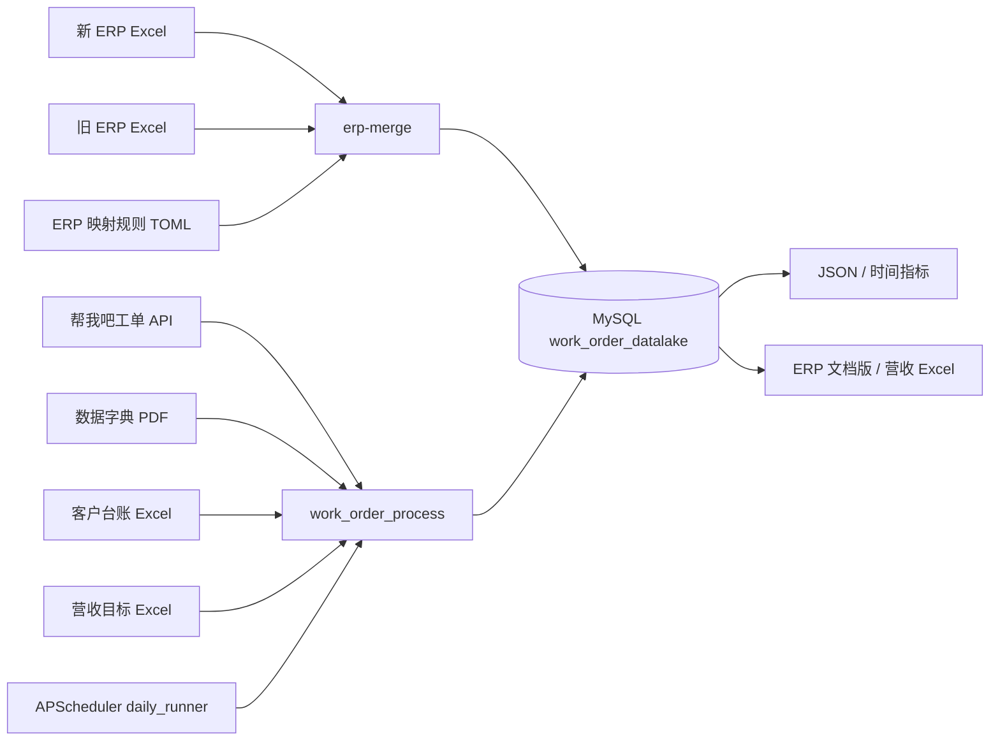
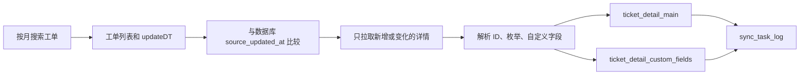
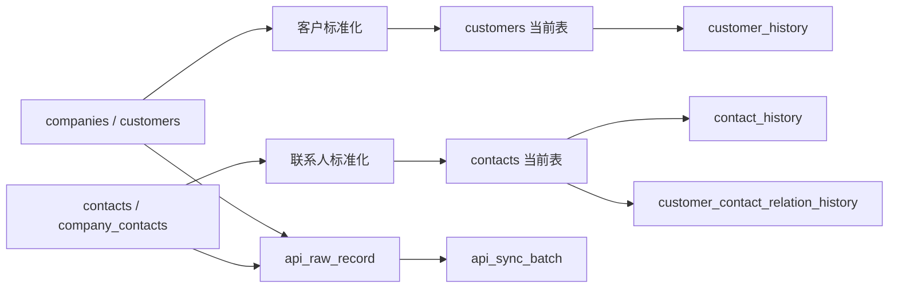
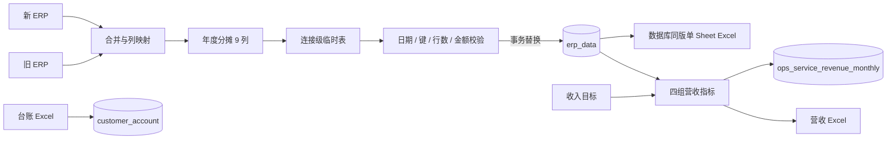

# work_order_process 项目接手手册

> 面向第一次接手本项目的开发人员。最后按代码提交 `25858ff` 核对，手册维护机制从
> `9ad5351` 开始。数据库字段和专项业务规则以本文链接的专题文档为准。

## 1. 快速接手

### 1.1 项目是做什么的

本项目把三类业务数据归集到 MySQL 数据库 `work_order_datalake`：

1. **工单域**：从“帮我吧”API 获取工单、客户和联系人，解析 ID、枚举和自定义字段，
   保存 JSON 或写入 MySQL。
2. **经营域**：将新旧 ERP Excel 合并为统一的 78 列标准数据，计算年度分摊后以快照
   方式写入 `erp_data`；将客户台账 Excel 写入 `customer_account`。
3. **分析域**：从 ERP 快照和收入目标文件生成
   `ops_service_revenue_monthly`，也可以从工单节点时间计算工作时长指标。

它既是命令行工具，也是生产服务器上的定时同步程序。不要把本项目理解成单纯的
Excel 脚本：数据库快照、API 调用、分区、事务和定时任务同样是核心部分。

### 1.2 技术栈

| 项目 | 当前选择 |
|---|---|
| 操作系统 | 本地 Windows 10 / PowerShell，生产 Linux |
| Python | `>=3.14` |
| 依赖管理 | `uv`，锁文件为 `uv.lock` |
| HTTP | `httpx`，HTTP Basic Auth |
| 数据库 | MySQL 8.x、PyMySQL、InnoDB、utf8mb4 |
| Excel | `openpyxl`、`xlrd`，ERP 额外使用 `pandas`、`numpy` |
| 调度 | APScheduler |
| 测试 | pytest |
| 部署 | systemd、logrotate、systemd timer |

### 1.3 目录位置

本地项目：

```text
D:\Users\python_project\work_order_process
```

生产模板默认项目目录：

```text
/opt/work_order_process
```

生产路径只是仓库模板中的约定。接手后必须从服务器实际配置核对，不能根据本文直接
假设服务器已经部署到某个提交。

### 1.4 第一次打开项目

以下命令不会访问 API 或修改数据库：

```powershell
Set-Location D:\Users\python_project\work_order_process
git status --short
git log --oneline -10
uv --version
uv sync --all-groups --locked
uv lock --check
uv run --all-groups pytest -q
uv run --all-groups work_order_process --help
uv run --all-groups erp-merge --help
```

预期：

- `uv sync` 按 `uv.lock` 创建或更新 `.venv`。
- `uv lock --check` 不改锁文件。
- pytest 全部通过。
- 两个 `--help` 能正常输出参数。
- `git status --short` 可能显示业务人员放入 `data/` 的未跟踪文件，不得擅自删除或提交。

### 1.5 创建本地配置

```powershell
Copy-Item .env.example .env
```

编辑 `.env`，填入实际环境值。真实值只能保存在本地或生产环境文件中，不能写入
README、`agents.md`、测试、日志或 Git 提交。

最低配置：

```dotenv
WORKORDER_USERNAME=replace_me
WORKORDER_PASSWORD=replace_me
WORKORDER_BASE_URL=https://workorder.bosssoft.com.cn/api/v1

WORKORDER_MYSQL_HOST=127.0.0.1
WORKORDER_MYSQL_PORT=3306
WORKORDER_MYSQL_USER=workorder
WORKORDER_MYSQL_PASSWORD=replace_me
WORKORDER_MYSQL_DATABASE=work_order_datalake
```

注意：`work_order_process` 主 CLI 会在进入大部分命令分支前调用
`load_settings()` 和 `DataDictionary.from_pdf(...)`。因此一些看似只操作 MySQL 的命令，
当前实现仍要求 API 用户名、密码和数据字典 PDF 存在。

### 1.6 第一天不要执行

没有确认环境、备份和业务日期前，不要执行：

- `mysql-drop-tables`：删除工单基础表。
- `mysql-import-year`：可能产生大量 API 请求和数据库写入。
- `import-erp`、`erp-merge`：会替换同一 `create_date` 的 ERP 正式快照。
- `generate-revenue-summary`：不带 `--revenue-preview` 会替换指定年月营收结果。
- `import-customer-account`：写入台账快照。
- `mysql-add-partitions`、`mysql-init`：执行 DDL。
- 修改或启停 systemd、logrotate、备份 timer。
- 轮换凭据、改 MySQL 权限、重写 Git 历史或强制推送。

先执行 `--help`、测试、API `probe`、客户/联系人 `probe` 或数据库只读 SQL。

## 2. 架构与数据流

### 2.1 系统组件



文字解释：

- `work_order_process` 是通用入口，负责 API、工单数据库、台账、已整理 ERP、营收和
  时间指标。
- `erp-merge` 是原始 ERP 入口，完成新旧 Excel 合并、清洗、分摊、入库和数据库导出。
- PDF 数据字典用于英文值到中文标签的翻译。
- MySQL 是正式数据来源；ERP 文档版在发布后从数据库重新查询生成。
- `daily_runner` 复用工单、客户和联系人同步函数，不另写一套导入逻辑。

### 2.2 工单数据流



关键点：

1. 月度搜索按 `createDT` 范围找工单。
2. 并发导入会先对比数据库 `source_updated_at`，未变化工单记为 skipped。
3. 详情保留原始 ID，并补充联系人、客户、客服、客服组、模板等名称。
4. 高频分析字段进入主表，动态自定义字段进入 EAV 明细表。
5. 批次结果写入 `sync_task_log`；失败记录写到月度失败日志。

### 2.3 客户和联系人数据流



同步使用行哈希判断业务字段是否变化，当前表用于业务查询，history 表保留版本。联系人
通过 `customer_id` 关联客户；工单通过 `company_id` 和 `cust_user_id` 关联两者。

### 2.4 ERP、台账和营收数据流



ERP 正式发布过程：

1. 读取新旧 ERP 和字段对照表。
2. 标准化表头、营销平台、金额、日期和文本。
3. 生成 69 个业务字段和 9 个年度分摊字段。
4. 先写连接级临时表，校验非空业务键、唯一快照日期、重复业务键、行数和分摊字段。
5. 在单个事务中删除同日旧快照并插入新快照；失败则回滚。
6. 从已提交数据库快照导出文档版 Excel。

台账是独立快照。与 ERP 常用逻辑关联为
`contract_code = contract_id`、`item_code = item_code`，但台账数据允许业务重复，不能
未经分析直接增加严格唯一约束。

营收生成先验证 ERP 快照存在且调整后分摊不为空，再按营销平台聚合；正式模式在事务中
完整替换指定 `stat_year + stat_month` 的平台集合。

### 2.5 定时数据流

`work_order_process.daily_runner` 使用 Asia/Shanghai 时区：

| 时间 | 任务 | 内容 |
|---|---|---|
| 每天 02:17 | `sync_tickets_daily` | 当前月和前三个月工单 |
| 每周日 03:17 | `sync_customers_contacts` | 客户和联系人 |
| 每月 1 日 04:17 | `monthly_maintenance` | 滚动窗口外旧月份和未来分区 |

任一月份失败后，其他月份仍继续；任务结束时汇总失败并向 APScheduler 抛出
`ScheduledSyncError`。生产由 systemd 管理进程，由 logrotate 管理文件日志。

## 3. 项目目录

```text
work_order_process/
├─ .github/workflows/test.yml       # GitHub Actions
├─ config/                          # ERP、时间指标、工作日历规则
├─ deploy/                          # systemd、logrotate、备份模板
├─ docs/                            # 接手手册和专题文档
├─ scripts/                         # 运维/导出脚本
├─ sql/                             # ERP、台账、营收表和视图
├─ src/work_order_process/          # Python 包
│  └─ erp_merge/                    # 新旧 ERP 合并子系统
├─ tests/                           # pytest，与源码模块对应
├─ .env.example                     # 无真实凭据的配置示例
├─ main.py                          # 兼容入口，调用主 CLI
├─ merge_erp_data.py                # 兼容入口，调用 erp-merge
├─ pyproject.toml                   # 包、入口和依赖
└─ uv.lock                          # 精确依赖锁
```

重要规则：

- `data/` 存放业务源文件，不纳入常规代码扫描和提交。
- `output/` 是生成目录，已被 Git 忽略。
- `docs/superpowers/specs` 和 `plans` 是历史设计、计划，不是运行手册。
- `sql/*.sql` 与 Python DDL 都可能影响数据库；改表时要同时检查两处。

## 4. 配置与依赖

### 4.1 uv 依赖组

安装运行时依赖：

```powershell
uv sync --locked
```

安装测试和 ERP 全部依赖：

```powershell
uv sync --all-groups --locked
```

| 依赖组 | 内容 | 使用场景 |
|---|---|---|
| 默认 | HTTP、MySQL、PDF、Excel、调度等 | 工单和通用 CLI |
| `dev` | pytest | 开发和 CI |
| `erp` | pandas、numpy | `erp-merge` |

运行 ERP 或完整测试时使用 `--all-groups`。生产完成同步后，systemd 直接调用
`.venv/bin/python`，避免启动服务时解析依赖。

### 4.2 环境变量

| 变量 | 默认值 | 作用 |
|---|---|---|
| `WORKORDER_USERNAME` | 无，必填 | 工单 API Basic Auth 用户名 |
| `WORKORDER_PASSWORD` | 无，必填 | 工单 API Basic Auth 密码 |
| `WORKORDER_BASE_URL` | 帮我吧 API v1 地址 | API 根地址 |
| `WORKORDER_CUSTOMER_PATHS` | 多个候选路径 | 客户接口，逗号分隔 |
| `WORKORDER_CONTACT_PATHS` | 多个候选路径 | 联系人接口，逗号分隔 |
| `WORKORDER_TICKET_PATHS` | 多个候选路径 | 工单接口，逗号分隔 |
| `WORKORDER_HTTP_METHODS` | `GET,POST` | 探测候选请求方法 |
| `WORKORDER_TICKET_SINCE` | `2025-01-01` | 默认工单起始日期 |
| `WORKORDER_SAMPLE_SIZE` | `10` | 配置层默认样本数 |
| `WORKORDER_PAGE_SIZE` | `100` | 配置层默认分页 |
| `WORKORDER_MAX_PAGES` | `200` | 接口最大分页数 |
| `WORKORDER_DICTIONARY_PATH` | 根目录 PDF | 数据字典路径 |
| `WORKORDER_OUTPUT_DIR` | 根目录 `output` | 输出目录 |
| `WORKORDER_MYSQL_HOST` | `127.0.0.1` | MySQL 主机 |
| `WORKORDER_MYSQL_PORT` | `3306` | MySQL 端口 |
| `WORKORDER_MYSQL_USER` | `workorder` | 应用账号，禁止默认 root |
| `WORKORDER_MYSQL_PASSWORD` | 空 | MySQL 密码 |
| `WORKORDER_MYSQL_DATABASE` | `work_order_datalake` | 数据库 |

CLI 参数默认值不一定等于配置层默认值。例如主 CLI 的 `--year` 默认是 2025、
`--sample-size` 默认是 3、`--per-page` 默认是 5000。执行行为以 CLI `--help` 为准。

### 4.3 ERP 规则

`config/erp_merge_rules.toml` 是长期 ERP 规则的单一配置来源，包含：

- `营销平台映射`：旧平台名称归并到当前平台。
- `体系工程师`：最终营销平台到体系工程师。
- `金额换算`：旧 ERP 的收入基数、分成比例、开票和回款来源字段。

统计年度不再固定在 TOML 中，由 `--statistics-year` 指定，默认取运行年份。修改映射后
必须运行 ERP 映射、流水线和快照导入测试。

### 4.4 时间指标配置

`config/time_metrics.json` 中每个指标包含：

```json
{
  "code": "example_node_duration",
  "name": "示例节点工作时长",
  "start_field": "field_249",
  "end_field": "field_331",
  "unit": "minutes",
  "enabled": true
}
```

`config/work_calendar_cn_2026.json` 定义工作时段、法定假日和调休上班日。跨年度计算前
必须提供对应年份日历，不能把 2026 日历直接用于其他年份。

## 5. 命令参考

### 5.1 风险级别

| 级别 | 含义 |
|---|---|
| R0 | 只读或显示帮助 |
| R1 | 调用 API 或只写本地输出 |
| R2 | 数据库新增、更新或快照替换 |
| R3 | DDL、删表、生产服务或凭据操作 |

主入口：

```powershell
uv run --all-groups work_order_process <command> [options]
```

不传 `<command>` 时默认执行 `run`。多数命令仍会加载 API 配置和 PDF 字典。

### 5.2 常用参数

| 参数 | 说明 |
|---|---|
| `--year` | 年份，CLI 默认 2025 |
| `--month` | 月份 1-12 |
| `--ticket-id` | 单工单或单工单指标 |
| `--per-page` | 工单搜索分页大小 |
| `--limit-per-month` | 调试时限制每月记录数 |
| `--overwrite` | 覆盖已有本地输出 |
| `--max-workers` | 并发详情线程，默认 8 |
| `--batch-size` | 数据库事务批大小，默认 100 |
| `--api-rate-limit` | API QPS 上限，默认 10 |

### 5.3 工单导出命令

#### `run`（R1）

按年或月导出工单列表，并抽样生成 raw、value_resolved、chinese 三段式详情。

```powershell
uv run --all-groups work_order_process run `
  --year 2026 --month 6 --sample-size 3 --detail-workers 4
```

输出位于 `output/2026_monthly_tickets` 和
`output/2026_monthly_sample_details`。已有完整文件默认复用；使用 `--overwrite`
重建。先用 `--limit-per-month 10` 验证接口。

#### `monthly-tickets`（R1）

只导出月度列表，不获取详情样本。

```powershell
uv run --all-groups work_order_process monthly-tickets --year 2026 --month 6
```

#### `template-samples`（R1）

按工单模板分别抽样，必须指定月份。

```powershell
uv run --all-groups work_order_process template-samples `
  --year 2026 --month 6 --sample-size 3 --seed 202606
```

### 5.4 API 和数据字典命令

#### `probe`（R0/R1）

认证后探测配置的客户、联系人和工单候选接口，只用于小规模连通性检查。

```powershell
uv run --all-groups work_order_process probe
```

#### `dictionary`（R1）

解析 PDF 并写出 `output/dictionary.json`。

```powershell
uv run --all-groups work_order_process dictionary
```

### 5.5 工单数据库命令

#### `mysql-init`（R3）

创建工单基础表、客户联系人分析表以及所需分区。该命令不是清空重建，但会执行 DDL。

```powershell
uv run --all-groups work_order_process mysql-init
```

执行前确认 `.env` 指向目标库；执行后查询 `INFORMATION_SCHEMA.TABLES` 和
`INFORMATION_SCHEMA.PARTITIONS`。

#### `mysql-drop-tables`（R3，危险）

删除项目管理的工单基础表。CLI 不提供二次确认。

```powershell
# 仅在明确获批、确认目标库和可恢复备份后执行
uv run --all-groups work_order_process mysql-drop-tables
```

生产环境通常不应使用此命令。

#### `mysql-create-analysis-views`（R3）

创建或刷新客户、联系人分析视图。

```powershell
uv run --all-groups work_order_process mysql-create-analysis-views
```

#### `mysql-import-ticket`（R2）

拉取一张工单详情并 upsert。

```powershell
uv run --all-groups work_order_process mysql-import-ticket --ticket-id 22256891
```

适合验证认证、详情解析和数据库权限。

#### `mysql-import-month`（R2）

当前并发单月导入。先比较 `source_updated_at`，只重新拉取新增或变化详情。

```powershell
uv run --all-groups work_order_process mysql-import-month `
  --year 2026 --month 6 `
  --max-workers 2 --batch-size 20 --api-rate-limit 3 `
  --limit-per-month 100
```

验证后移除 `--limit-per-month` 并提高并发。检查 `sync_task_log`、月份行数和失败日志。

#### `mysql-import-month-v1`（R2）

保留的串行导入方式，只用于调试对比，不作为日常生产路径。

```powershell
uv run --all-groups work_order_process mysql-import-month-v1 `
  --year 2026 --month 6 --limit-per-month 10
```

#### `mysql-import-year`（R2）

按月执行全年导入；指定 `--month` 时只处理该月。大数据量运行应持续观察日志和数据库。

```powershell
uv run --all-groups work_order_process mysql-import-year `
  --year 2026 --max-workers 8 --batch-size 100 --api-rate-limit 10
```

不要把工具命令超时直接认定为导入失败，应从 `sync_task_log`、进程和月份行数核对。

#### `mysql-add-partitions`（R3）

提前创建未来月份分区，默认 6 个月。

```powershell
uv run --all-groups work_order_process mysql-add-partitions --months-ahead 6
```

#### `mysql-sync-log`（R0）

显示最近同步日志。

```powershell
uv run --all-groups work_order_process mysql-sync-log --log-limit 20
```

当前命令位于 API 客户端上下文内，会先认证 API；API 不可用时可直接用 SQL 查询
`sync_task_log`。

### 5.6 客户和联系人命令

#### `mysql-probe-customers`（R0/R1）

只读探测客户候选路径并显示少量样本。

```powershell
uv run --all-groups work_order_process mysql-probe-customers --sample-size 3
```

#### `mysql-probe-contacts`（R0/R1）

只读探测联系人候选路径。

```powershell
uv run --all-groups work_order_process mysql-probe-contacts --sample-size 3
```

#### `mysql-import-customers`（R2）

同步客户当前表、历史表、原始记录和批次。当前代码默认来源是 `companies`。

```powershell
uv run --all-groups work_order_process mysql-import-customers `
  --customers-source companies --max-records 100
```

来源可为 `companies`、`customers`、`both`。默认禁止空结果成功；只有确认接口合法返回空
集合时才使用 `--allow-empty`。

#### `mysql-import-contacts`（R2）

同步联系人和客户关系。当前代码默认来源是 `contacts`。

```powershell
uv run --all-groups work_order_process mysql-import-contacts `
  --contacts-source contacts --max-records 100
```

来源可为 `contacts`、`company_contacts`、`both`。

> CLI 参数帮助文字称客户和联系人默认来源为 both，但当前 `argparse` 实际默认分别为
> `companies` 和 `contacts`。接手时以代码默认值为准；后续应修正帮助文字。

### 5.7 人员、台账和已整理 ERP

#### `mysql-import-personnel`（R2）

导入旧格式 `.xls` 人员名单并按 `employee_no` upsert。

```powershell
uv run --all-groups work_order_process mysql-import-personnel `
  --personnel-file "D:\path\人员信息名单.xls"
```

Excel 数字工号会规范化为无 `.0` 的字符串。详见
[人员名单 MySQL 导入说明](personnel_mysql_usage.md)。

#### `import-customer-account`（R2）

导入台账快照，必须显式指定源文件和 `YYYYMMDD` 快照日期。

```powershell
uv run --all-groups work_order_process import-customer-account `
  --customer-account-file "D:\path\客户台账.xlsx" `
  --create-date 20260724 `
  --sheet "Sheet1"
```

省略 `--sheet` 时取第一个工作表。执行后按 `create_date` 检查行数和关键字段空值。

#### `import-erp`（R2）

导入已经整理好的 69 列历史标准或 78 列当前标准 ERP 工作簿。工作表按完整表头识别，
不是按 Sheet 名称识别。

```powershell
uv run --all-groups work_order_process import-erp `
  --erp-file "D:\path\标准ERP.xlsx"
```

78 列流程要求九个年度分摊字段完整。非法非空金额、空业务键、重复业务键、多快照日期
都会终止发布。成功时完整替换同日快照。

### 5.8 原始 ERP 一体化入口 `erp-merge`（R2）

这是以后常规 ERP 更新的首选入口：

```powershell
uv run --all-groups erp-merge `
  --config "D:\path\新旧ERP字段对照.xlsx" `
  --input-new "D:\path\新ERP.xlsx" `
  --input-old "D:\path\旧ERP.xlsx" `
  --statistics-year 2026 `
  --document-output "output\erp_merge\新旧ERP数据库快照文档版.xlsx"
```

处理顺序：合并原始数据 → 生成标准 78 列 → 写数据库 → 从数据库导出文档版。

| 参数 | 必填 | 说明 |
|---|---|---|
| `--config` | 是 | 新旧 ERP 字段对照 Excel |
| `--input-new` | 是 | 新 ERP 源文件 |
| `--input-old` | 是 | 旧 ERP 源文件 |
| `--document-output` | 是 | 数据库文档版输出，不可再次作为导入源 |
| `--standard-output` | 否 | 额外输出标准 78 列核对文件 |
| `--statistics-year` | 否 | 统计年度，默认当前年份 |
| `--last-year-start/end` | 否 | 覆盖去年统计区间 |
| `--current-year-start/end` | 否 | 覆盖今年统计区间 |

只有核对需求时才加：

```powershell
--standard-output "output\erp_merge\标准Sheet1核对.xlsx"
```

`--standard-output` 和 `--document-output` 不能是同一路径。文档版包含展示格式，不可导入。

### 5.9 月度营收命令

#### `generate-revenue-summary`（预览 R1，正式 R2）

先生成预览：

```powershell
uv run --all-groups work_order_process generate-revenue-summary `
  --year 2026 --month 6 `
  --erp-create-date 20260717 `
  --revenue-target-file "D:\path\运维服务营收数据表.xlsx" `
  --revenue-preview
```

人工核对后移除 `--revenue-preview` 才写库：

```powershell
uv run --all-groups work_order_process generate-revenue-summary `
  --year 2026 --month 6 `
  --erp-create-date 20260717 `
  --revenue-target-file "D:\path\运维服务营收数据表.xlsx"
```

规则：

- `--month` 和目标文件必填。
- 省略 `--erp-create-date` 时取 `erp_data.MAX(create_date)`，生产重跑建议显式指定。
- `--revenue-output` 可覆盖输出文件路径。
- 正式模式整月替换，不是逐平台 upsert 后保留旧平台。
- 快照不存在、分摊字段为空或没有有效营收指标时拒绝生成。

### 5.10 时间指标命令

#### `metric-month`（R1，只读数据库）

```powershell
uv run --all-groups work_order_process metric-month `
  --year 2026 --month 6 `
  --metrics-config config\time_metrics.json `
  --calendar-path config\work_calendar_cn_2026.json
```

可用 `--metric-code` 只算一个指标、`--limit-per-month` 限制工单数、`--output` 指定 JSON。

#### `metric-ticket`（R1，只读数据库）

```powershell
uv run --all-groups work_order_process metric-ticket `
  --ticket-id 22256891 `
  --metric-code example_node_duration
```

时间指标当前只导出 JSON，不写入新数据库表。详见
[工单节点工作时长指标说明](time_metrics_usage.md)。

## 6. 模块与函数参考

本章先说明模块职责，随后列出所有顶层类和函数。完整限定名用于代码搜索，也由测试保证
新增符号时必须更新本文。

### 6.1 模块职责总表

| 模块 | 职责 | 主要副作用 |
|---|---|---|
| `work_order_process.api` | 帮我吧 API 认证、探测、分页、详情和缓存 | HTTP 请求 |
| `work_order_process.config` | `.env`、端点和 MySQL 配置 | 读取环境变量 |
| `work_order_process.cli` | 通用命令路由和终端输出 | 取决于子命令 |
| `work_order_process.dictionary` | PDF 数据字典解析和中文化 | 读 PDF、写 JSON |
| `work_order_process.monthly_export` | 月度列表和详情样本导出 | API、JSON 文件 |
| `work_order_process.resolver` | ID、枚举、自定义字段和值解析 | API 详情请求、内存变换 |
| `work_order_process.structured_ticket` | 工单数据库/Excel 行结构 | 纯转换 |
| `work_order_process.transform` | 旧式列表筛选、补全和翻译 | 纯转换 |
| `work_order_process.mysql_storage` | 工单表、分区、导入和同步日志 | MySQL、API、失败 JSON |
| `work_order_process.structured_entities` | 客户和联系人标准行 | 纯转换 |
| `work_order_process.customer_contact_sync` | 当前表、历史表和原始记录同步 | API、MySQL |
| `work_order_process.personnel_import` | 人员 `.xls` 导入 | Excel、MySQL |
| `work_order_process.customer_account_import` | 台账 Excel 快照导入 | Excel、MySQL |
| `work_order_process.auxiliary_schema` | 确保 ERP 和台账表存在 | MySQL DDL |
| `work_order_process.erp_schema` | ERP 69/78 列结构常量 | 无 |
| `work_order_process.erp_import` | 标准 ERP 校验和原子发布 | Excel/DataFrame、MySQL |
| `work_order_process.erp_migrations` | 补充 ERP 年度分摊列 | MySQL DDL |
| `work_order_process.erp_document_export` | 从数据库导出 ERP 文档版 | MySQL、Excel |
| `work_order_process.erp_merge.config` | ERP TOML 规则校验 | 读 TOML |
| `work_order_process.erp_merge.mapping` | 新旧字段、平台、金额和格式清洗 | DataFrame 变换 |
| `work_order_process.erp_merge.calculator` | 重叠天数和年度分摊 | DataFrame 变换 |
| `work_order_process.erp_merge.pipeline` | 原始 ERP 端到端合并和 Excel 输出 | Excel、DataFrame |
| `work_order_process.erp_merge.cli` | 原始 ERP 一体化命令 | Excel、MySQL |
| `work_order_process.revenue_summary` | 营收目标、指标、写库和 Excel | Excel、MySQL |
| `work_order_process.business_time` | 工作日历和工作时长 | 读 JSON |
| `work_order_process.time_metrics` | 月度/单工单节点时长 | MySQL 只读、JSON |
| `work_order_process.daily_runner` | 生产定时任务 | API、MySQL、日志 |
| `work_order_process.io` | UTF-8 JSON 写入 | 文件 |

`work_order_process.erp_merge.__init__` 当前只标识子包，没有业务入口；公共入口注册在
`pyproject.toml`，实际调用 `work_order_process.erp_merge.cli.main`。

### 6.2 核心入口和异常

#### `work_order_process.cli.main`

- 签名：`main() -> None`
- 职责：定义通用 CLI 参数，加载配置和数据字典，再路由到具体业务函数。
- 输入：`sys.argv`。
- 输出：Rich 终端表格；业务函数可能输出 JSON、Excel 或写数据库。
- 异常：API 错误转为退出码 2，配置错误转为退出码 3；其他数据或数据库异常向上抛出。
- 调用关系：控制台入口 `work_order_process` 和根目录 `main.py`。

#### `work_order_process.erp_merge.cli.main`

- 签名：`main(argv: Iterable[str] | None = None) -> None`
- 职责：原始新旧 ERP 合并、标准化、分摊、入库和数据库文档版导出。
- 输入：两个源 Excel、字段对照 Excel、统计年度/区间和输出路径。
- 副作用：同日 ERP 快照事务替换，成功后写 Excel。
- 关键约束：文档版与可选标准版路径不同；数据库发布成功后才导出文档版。

#### 项目级异常

| 异常 | 产生位置 | 含义 |
|---|---|---|
| `work_order_process.api.ApiError` | API 和 CLI 参数 | 认证、HTTP、响应格式或命令参数错误 |
| `work_order_process.config.ConfigError` | 配置加载 | 必填凭据缺失或配置非法 |
| `work_order_process.erp_import.ERPImportError` | ERP 入库 | 转换、校验、临时表或事务发布失败 |
| `work_order_process.erp_merge.mapping.InvalidNumericValue` | ERP 清洗 | 非空金额无法解析 |
| `work_order_process.revenue_summary.RevenueSnapshotError` | 营收 | ERP 快照不安全或汇总发布失败 |
| `work_order_process.daily_runner.ScheduledSyncError` | 调度 | 一个或多个月份同步失败 |

### 6.3 API 客户端

#### `work_order_process.api.WorkOrderClient`

封装一个 `httpx.Client`，使用 `httpx.BasicAuth`。应通过 `with` 使用以确保连接关闭：

```python
with WorkOrderClient(settings) as client:
    client.authenticate()
    detail = client.fetch_ticket_detail("22256891")
```

主要方法：

| 方法 | 用途 |
|---|---|
| `authenticate()` | 通过候选端点验证 Basic Auth |
| `probe_paths()` / `probe_entity_paths()` | 只读探测路径、数量和字段键 |
| `fetch_all()` | 从候选路径取完整列表 |
| `iter_entity_pages()` | 分页流式返回客户或联系人 |
| `fetch_companies()` / `fetch_customers()` | 客户列表 |
| `fetch_contacts()` / `fetch_company_contacts()` | 联系人列表 |
| `fetch_ticket_detail()` | 单工单详情 |
| `search_tickets_by_create_month()` | 按创建月份搜索 |
| `search_tickets_by_create_month_and_template()` | 按月份和模板搜索 |
| `fetch_contact_detail()` / `fetch_company_detail()` | 解析工单引用实体 |
| `fetch_support_detail()` / `fetch_support_group_detail()` | 客服和客服组名称 |
| `fetch_ticket_template_detail()` | 工单模板名称 |
| `prefetch_entities()` | 批量预热实体详情缓存 |
| `clear_cache()` | 清除详情 LRU 缓存 |

`_request()` 尝试配置的 HTTP 方法；`_json_or_empty()` 会修复接口文本中不合法的裸反斜杠
再解析 JSON。不要在日志中打印完整响应，响应可能包含客户个人信息。

### 6.4 工单解析和导入核心

#### `work_order_process.resolver.resolve_ticket_detail_values`

- 输入：原始工单详情、API 客户端和可复用的 `TicketFieldResolver`。
- 输出：深复制后的可读详情，保留原 ID 并增加名称字段。
- 行为：解析联系人、客户、客服、客服组、模板、枚举、Unix 时间戳和自定义字段。
- 分析维度：从 resolved `custom_fields` 提取省、市、区县、产品线等到主表顶层。

#### `work_order_process.mysql_storage.import_month_tickets_to_mysql`

- 输入：MySQL 配置、数据字典、已认证客户端、年月、并发和批次参数。
- 流程：月度列表 → 对比 `source_updated_at` → 预取实体 → 并发取详情 → 批次事务写入。
- 返回：总数、inserted、updated、skipped、failed 和失败 ID。
- 失败：单批失败后有逐行定位逻辑；最终状态写 `sync_task_log`。

#### `work_order_process.mysql_storage.upsert_ticket_detail`

单工单事务边界。主表使用 upsert，自定义字段按该工单全量刷新。主表与明细任一步失败都
回滚，返回值为 `inserted` 或 `updated`。

### 6.5 客户联系人同步核心

#### `work_order_process.customer_contact_sync.MySQLCustomerContactStore`

持有一个 MySQL 连接，负责：

- 建立和结束 `api_sync_batch`。
- 保存 `api_raw_record`。
- 更新 `customers` 或 `contacts` 当前行。
- 当行哈希变化时关闭旧 history 版本并插入新版本。
- 保存联系人到客户关系历史。

`save_entity()` 保证单实体写入原子性；前面已完成实体不会因后续实体失败而丢失。

#### `work_order_process.customer_contact_sync.sync_customer_entities`

按来源分页拉取客户，标准化后保存，默认禁止空结果被标记为成功。

#### `work_order_process.customer_contact_sync.sync_contact_entities`

联系人对应入口，同时维护联系人当前、历史和客户关系历史。

### 6.6 ERP 核心

#### `work_order_process.erp_merge.pipeline.merge_erp_sources`

读取字段对照和两个 ERP 源文件，定位真实表头、删除合计行、将旧字段映射到新口径，
移除新 ERP 已覆盖的旧行，并按快照业务键去重。输出仍是未增加九列分摊的合并
DataFrame。

#### `work_order_process.erp_merge.calculator.calculate_period_allocation`

核心公式：

```text
分摊金额 = 产品金额 × 合同服务期与统计区间重叠天数 ÷ 合同天数
```

合同天数和重叠天数都包含起止日期。无重叠、日期非法或合同天数无效时按规则得到零。

#### `work_order_process.erp_merge.calculator.add_statistical_allocation_columns`

增加九列：

```text
contract_days
prev_year_period_start
prev_year_period_end
prev_year_calc_amort
prev_year_adjusted_amort
cur_year_period_start
cur_year_period_end
cur_year_calc_amort
cur_year_adjusted_amort
```

倒签调整口径是“今年加去年、去年减今年”，用于把跨年度倒签影响重新归入对应年度。

#### `work_order_process.erp_import._import_erp_records`

ERP 发布总控：

1. 确保表结构。
2. 加载 20260713 营销平台基准和体系工程师映射。
3. 转换并校验每行。
4. 分批写临时表。
5. 校验行数、业务键、日期和分摊。
6. 开启事务，删除并重建同日正式快照。
7. 提交或回滚。

业务唯一键为 `contract_id + item_code + exec_detail_id + create_date`。标准 78 列流程
不允许九个分摊字段为空。

### 6.7 营收核心

#### `work_order_process.revenue_summary.generate_revenue_summary`

营收总控函数。读取目标、选 ERP 快照、验证、执行 SQL 聚合、构造平台行，正式模式写库，
最后导出 Excel。`persist=False` 即 CLI 的 `--revenue-preview`。

#### `work_order_process.revenue_summary.fetch_revenue_metrics`

按营销平台聚合确收、非暂估确收、去年确收、在手合同和签约金额。金额 SQL 先
`ROUND(..., 0)`，Python 再用 `ROUND_HALF_UP` 保持整数口径。

#### `work_order_process.revenue_summary.replace_revenue_rows`

在当前连接事务内删除指定年月全部平台，再插入目标文件中的完整平台集合并校验行数。
调用者负责提交；异常时连接关闭或上层回滚。

### 6.8 工作时长核心

#### `work_order_process.business_time.WorkCalendar`

`from_json()` 加载时段和日期覆盖；`is_workday()` 先看指定日期覆盖，再按周一到周五；
`day_name()` 返回节假日或调休名称。

#### `work_order_process.time_metrics.export_month_time_metrics`

从 `ticket_detail_main` 和 `ticket_detail_custom_fields` 只读提取月份工单和配置字段，
按工作日历计算指标并输出 JSON。

#### `work_order_process.time_metrics.export_ticket_time_metrics`

单工单版本，适合调试新指标和确认节点字段。

### 6.9 全部顶层符号索引

以下列表是快速定位入口。前导下划线表示模块内部实现；外部代码优先调用无下划线公共
函数。

#### API：`work_order_process.api`

- `work_order_process.api.ApiError`：API 项目级异常。
- `work_order_process.api.TicketSearchResponse`：工单搜索 TypedDict。
- `work_order_process.api.TicketDetail`：工单详情 TypedDict。
- `work_order_process.api.EndpointResult`：端点探测结果。
- `work_order_process.api.WorkOrderClient`：API 客户端。
- `work_order_process.api._json_or_empty`：安全解析/修复 JSON。
- `work_order_process.api._repair_invalid_json_escapes`：修复裸反斜杠。
- `work_order_process.api._copy_detail`：缓存详情防御性复制。
- `work_order_process.api._looks_successful`：统一 HTTP/业务成功判断。
- `work_order_process.api._extract_items`：兼容不同列表字段。
- `work_order_process.api._declared_item_count`：读取响应总数。
- `work_order_process.api._has_more`：判断分页。
- `work_order_process.api._record_is_since`：按起始日期筛选。
- `work_order_process.api._record_datetime`：读取记录时间。
- `work_order_process.api._parse_datetime`：解析常见时间格式。

#### 配置和入口

- `work_order_process.config`：项目配置模块。
- `work_order_process.config._split_csv`：逗号配置转列表。
- `work_order_process.config.EndpointConfig`：候选端点配置。
- `work_order_process.config.MySQLConfig`：MySQL 连接配置。
- `work_order_process.config.Settings`：完整运行配置。
- `work_order_process.config.ConfigError`：配置异常。
- `work_order_process.config.load_settings`：加载 `.env` 和环境变量。
- `work_order_process.cli`：通用 CLI 模块。
- `work_order_process.cli.main`：CLI 总入口。
- `work_order_process.cli._resolve_sources`：解析单/多来源。
- `work_order_process.cli._print_sync_log`：显示同步日志。
- `work_order_process.cli._print_erp_import_report`：ERP 报告。
- `work_order_process.cli._print_revenue_summary_report`：营收报告。
- `work_order_process.cli._print_customer_account_import_report`：台账报告。
- `work_order_process.cli._print_personnel_import_report`：人员报告。
- `work_order_process.cli._get_log_limit`：延迟取日志条数。
- `work_order_process.cli._probe`：通用 API 探测。
- `work_order_process.cli._print_entity_probe`：实体探测摘要。
- `work_order_process.cli._print_year_report`：年度导出报告。
- `work_order_process.cli._print_monthly_ticket_report`：月度列表报告。
- `work_order_process.cli._print_template_sample_report`：模板抽样报告。
- `work_order_process.cli._print_mysql_import_report`：单工单入库报告。
- `work_order_process.cli._print_mysql_month_report`：月度入库报告。
- `work_order_process.cli._print_mysql_year_report`：年度入库报告。
- `work_order_process.cli._print_customer_contact_report`：客户联系人报告。
- `work_order_process.cli._print_time_metric_report`：时间指标报告。
- `work_order_process.cli._print_dictionary_summary`：字典字段数量。

#### 数据字典、文件和通用转换

- `work_order_process.dictionary`：数据字典模块。
- `work_order_process.dictionary.FieldDefinition`：单字段定义。
- `work_order_process.dictionary.normalize_text`：PDF 文本规范化。
- `work_order_process.dictionary._normalize_key`：宽松匹配字段名。
- `work_order_process.dictionary.label_from_comment`：从备注提取中文标签。
- `work_order_process.dictionary.DataDictionary`：字典查找、翻译和序列化。
- `work_order_process.dictionary._iter_table_sections`：定位 PDF 表段落。
- `work_order_process.dictionary._parse_fields`：解析表字段。
- `work_order_process.dictionary.fallback_dictionary`：PDF 失败时的核心兜底。
- `work_order_process.io`：文件输出模块。
- `work_order_process.io.write_json`：以 UTF-8、中文不转义写 JSON。
- `work_order_process.transform`：列表级转换模块。
- `work_order_process.transform.filter_tickets_since`：起始日期筛选。
- `work_order_process.transform.random_sample`：可复现随机抽样。
- `work_order_process.transform.enrich_tickets`：用客户联系人列表补工单。
- `work_order_process.transform.translate_many`：批量中文化。
- `work_order_process.transform._index_by_any`：兼容多主键字段建索引。
- `work_order_process.transform._first_value`：候选字段取值。
- `work_order_process.transform._first_datetime`：候选时间解析。

#### 月度导出：`work_order_process.monthly_export`

- `work_order_process.monthly_export.export_year_monthly_tickets_and_samples`：年度列表和详情三件套。
- `work_order_process.monthly_export.export_year_monthly_tickets`：只导出月度列表。
- `work_order_process.monthly_export.export_month_template_samples`：按模板抽样详情。
- `work_order_process.monthly_export.build_month_label`：校验并格式化 `YYYY-MM`。
- `work_order_process.monthly_export._count_month_template_tickets`：模板工单计数。
- `work_order_process.monthly_export._sample_month_template_ticket_rows`：模板内抽样。
- `work_order_process.monthly_export.fetch_month_ticket_rows`：分页获取月度列表。
- `work_order_process.monthly_export._load_or_fetch_month_tickets`：复用或重新拉取。
- `work_order_process.monthly_export._export_month_sample_details`：写三段式详情。
- `work_order_process.monthly_export._fetch_sample_raw_details`：并发取样本详情。
- `work_order_process.monthly_export._progress_context`：可关闭的 Rich 进度条。
- `work_order_process.monthly_export._sample_ticket_rows`：固定种子抽样。
- `work_order_process.monthly_export._month_ticket_path`：月度输出路径。
- `work_order_process.monthly_export._load_json_object`：读已有 JSON。
- `work_order_process.monthly_export._is_partial_report`：识别调试样本文件。
- `work_order_process.monthly_export._slice_month_report`：内存截取前 N 条。
- `work_order_process.monthly_export._extract_search_rows`：提取搜索结果。
- `work_order_process.monthly_export._ticket_ids_from_rows`：按顺序去重 ID。
- `work_order_process.monthly_export._safe_int`：安全整数转换。
- `work_order_process.monthly_export._json_array_len`：统计已有 JSON 数组。

#### 工单结构：`work_order_process.structured_ticket`

- `work_order_process.structured_ticket.build_ticket_detail_main_row`：详情转主表行。
- `work_order_process.structured_ticket.build_ticket_detail_custom_field_rows`：详情转 EAV 行。
- `work_order_process.structured_ticket.build_main_excel_rows`：详情转 Excel 主表。
- `work_order_process.structured_ticket.build_custom_field_excel_rows`：详情转 Excel 动态字段。
- `work_order_process.structured_ticket.to_datetime`：时间转换。
- `work_order_process.structured_ticket.text_or_none`：普通值文本化。
- `work_order_process.structured_ticket.json_or_none`：复杂值 JSON 化。
- `work_order_process.structured_ticket.stringify_value`：用于 Excel 的值文本化。
- `work_order_process.structured_ticket.value_type`：识别值类型。

#### 工单解析：`work_order_process.resolver`

- `work_order_process.resolver.TicketFieldResolver`：自定义字段定义索引。
- `work_order_process.resolver.resolve_ticket_detail_values`：完整详情解析入口。
- `work_order_process.resolver._replace_contact`：补联系人名称。
- `work_order_process.resolver._replace_company`：补客户 ID 和名称。
- `work_order_process.resolver._replace_support`：补客服名称。
- `work_order_process.resolver._replace_support_group`：补客服组名称。
- `work_order_process.resolver._replace_support_list`：解析客服 ID 列表。
- `work_order_process.resolver._replace_support_group_list`：解析客服组 ID 列表。
- `work_order_process.resolver._replace_ticket_template`：补模板名称。
- `work_order_process.resolver._support_name_field`：ID 字段到姓名字段。
- `work_order_process.resolver._support_group_name_field`：ID 字段到组名字段。
- `work_order_process.resolver._replace_ticket_custom_fields`：解析自定义字段。
- `work_order_process.resolver._resolve_support_custom_value`：客服类自定义值。
- `work_order_process.resolver._replace_enum`：枚举中文化。
- `work_order_process.resolver._replace_unix_timestamp`：时间戳转换。
- `work_order_process.resolver._split_id_list`：兼容多种 ID 列表格式。
- `work_order_process.resolver._first_nonempty`：候选值兜底。
- `work_order_process.resolver._clean_analytic_value`：分析维度清洗。
- `work_order_process.resolver._set_if_blank`：仅补空字段。
- `work_order_process.resolver._analytic_value_to_text`：分析值文本化。
- `work_order_process.resolver._apply_region_value`：省市区分配。
- `work_order_process.resolver._extract_analytic_dimensions`：提取高频维度到顶层。

#### 工单数据库：`work_order_process.mysql_storage`

- `work_order_process.mysql_storage.ensure_mysql_schema`：创建基础表、分析表和分区。
- `work_order_process.mysql_storage._ensure_customer_contact_analytics_schema`：补客户联系人分析结构。
- `work_order_process.mysql_storage.create_customer_contact_analysis_views`：创建分析视图。
- `work_order_process.mysql_storage._add_missing_columns`：按迁移语句补列。
- `work_order_process.mysql_storage._ensure_ticket_detail_main_columns`：补主表后加列。
- `work_order_process.mysql_storage.drop_mysql_tables`：删除基础表，危险。
- `work_order_process.mysql_storage.get_existing_partitions`：查询工单分区。
- `work_order_process.mysql_storage.add_future_partitions`：拆分 `pmax` 创建月分区。
- `work_order_process.mysql_storage.generate_months_ahead`：生成未来年月。
- `work_order_process.mysql_storage._fetch_month_ticket_rows`：数据库导入专用月度搜索。
- `work_order_process.mysql_storage.import_ticket_detail_to_mysql`：单工单导入。
- `work_order_process.mysql_storage.import_month_tickets_serial`：串行单月调试导入。
- `work_order_process.mysql_storage.import_month_tickets_to_mysql`：并发增量单月导入。
- `work_order_process.mysql_storage._prefetch_ticket_entities`：批量预取详情引用。
- `work_order_process.mysql_storage._str_or_none`：字符串规范化。
- `work_order_process.mysql_storage._filter_ticket_rows_for_import`：过滤未变化工单。
- `work_order_process.mysql_storage._same_datetime`：秒精度时间比较。
- `work_order_process.mysql_storage._commit_batch_atomic`：新连接单事务提交一批。
- `work_order_process.mysql_storage._fetch_batch_details`：并发取原始和解析详情。
- `work_order_process.mysql_storage._commit_batch`：批量写入并按需逐行定位。
- `work_order_process.mysql_storage._safe_rollback`：连接可用时回滚。
- `work_order_process.mysql_storage.import_year_tickets_to_mysql`：逐月执行年度导入。
- `work_order_process.mysql_storage.import_customers_to_mysql`：客户同步外观函数。
- `work_order_process.mysql_storage.import_contacts_to_mysql`：联系人同步外观函数。
- `work_order_process.mysql_storage._write_sync_log`：写任务日志。
- `work_order_process.mysql_storage.build_ticket_detail_main_row`：主表转换兼容入口。
- `work_order_process.mysql_storage.build_ticket_detail_custom_field_rows`：明细转换兼容入口。
- `work_order_process.mysql_storage.upsert_ticket_detail`：单工单事务写入。
- `work_order_process.mysql_storage._upsert_ticket_detail`：cursor 级主表和明细写入。
- `work_order_process.mysql_storage._main_columns`：主表 insert 列顺序。
- `work_order_process.mysql_storage._fetch_existing_source_updated`：读取现有更新时间。
- `work_order_process.mysql_storage._insert_custom_rows`：批量写 EAV。
- `work_order_process.mysql_storage._pymysql`：延迟导入 PyMySQL。
- `work_order_process.mysql_storage._to_datetime`：数据库时间转换。
- `work_order_process.mysql_storage._text_or_none`：数据库文本转换。
- `work_order_process.mysql_storage._json_or_none`：数据库 JSON 转换。
- `work_order_process.mysql_storage._value_type`：明细值类型。

#### 客户和联系人标准化：`work_order_process.structured_entities`

- `work_order_process.structured_entities.build_customer_row`：客户接口记录转标准行。
- `work_order_process.structured_entities.build_contact_row`：联系人接口记录转标准行。
- `work_order_process.structured_entities.entity_row_hash`：业务字段稳定哈希。
- `work_order_process.structured_entities.first_value`：大小写不敏感候选取值。
- `work_order_process.structured_entities.require_text`：主键非空检查。
- `work_order_process.structured_entities.text_or_none`：文本转换。
- `work_order_process.structured_entities.parse_datetime`：接口时间解析。

#### 客户联系人同步：`work_order_process.customer_contact_sync`

- `work_order_process.customer_contact_sync.SyncReport`：同步报告数据类。
- `work_order_process.customer_contact_sync.MySQLCustomerContactStore`：同步存储边界。
- `work_order_process.customer_contact_sync.sync_customer_entities`：客户同步入口。
- `work_order_process.customer_contact_sync.sync_contact_entities`：联系人同步入口。
- `work_order_process.customer_contact_sync._sync_entities`：两类实体通用编排。
- `work_order_process.customer_contact_sync._iter_source_pages`：按实体和来源迭代分页。
- `work_order_process.customer_contact_sync._save_prepared_entities`：批量保存标准行。
- `work_order_process.customer_contact_sync._chunks`：列表分批。
- `work_order_process.customer_contact_sync._build_row`：选择客户/联系人转换器。
- `work_order_process.customer_contact_sync._finish_batch`：写批次最终状态。

#### 人员：`work_order_process.personnel_import`

- `work_order_process.personnel_import.build_personnel_row`：人员行标准化。
- `work_order_process.personnel_import.read_personnel_xls`：读取 `.xls` 第一表。
- `work_order_process.personnel_import.ensure_personnel_schema`：确保人员表。
- `work_order_process.personnel_import.import_personnel_xls_to_mysql`：人员导入总控。
- `work_order_process.personnel_import.upsert_personnel_rows`：按工号 upsert。
- `work_order_process.personnel_import._normalize_cell`：去空和数字 `.0`。

#### 台账：`work_order_process.customer_account_import`

- `work_order_process.customer_account_import._to_date`：台账日期转换。
- `work_order_process.customer_account_import._to_decimal`：金额转换。
- `work_order_process.customer_account_import._to_int`：整数转换。
- `work_order_process.customer_account_import._to_str`：文本转换。
- `work_order_process.customer_account_import.convert`：按目标列选择转换器。
- `work_order_process.customer_account_import.import_customer_account_xlsx`：台账批量入库。
- `work_order_process.customer_account_import.main`：脚本式台账入口。

#### 辅助表：`work_order_process.auxiliary_schema`

- `work_order_process.auxiliary_schema.ensure_auxiliary_schema`：幂等创建 `erp_data` 和
  `customer_account`。

#### ERP 结构和迁移

- `work_order_process.erp_schema`：ERP 列契约。
- `work_order_process.erp_schema.legacy_headers`：69 列历史表头。
- `work_order_process.erp_schema.standard_headers`：78 列当前表头。
- `work_order_process.erp_migrations`：ERP 列迁移模块。
- `work_order_process.erp_migrations.ensure_erp_allocation_columns`：只增加缺少的九列。
- `work_order_process.erp_document_export`：ERP 数据库导出模块。
- `work_order_process.erp_document_export.export_erp_snapshot_document`：流式导出单快照。

#### ERP 标准入库：`work_order_process.erp_import`

- `work_order_process.erp_import.ERPImportError`：ERP 发布异常。
- `work_order_process.erp_import._to_date`：日期转换。
- `work_order_process.erp_import._to_decimal`：有限 Decimal 转换。
- `work_order_process.erp_import._to_int`：整数转换。
- `work_order_process.erp_import._to_str`：文本转换。
- `work_order_process.erp_import._to_create_date`：时间戳截取 `YYYYMMDD`。
- `work_order_process.erp_import.convert`：列转换和严格金额错误。
- `work_order_process.erp_import._header_labels`：读取首行表头。
- `work_order_process.erp_import.find_standard_sheet`：按完整表头识别唯一工作表。
- `work_order_process.erp_import._baseline_key`：构造三字段业务键。
- `work_order_process.erp_import.apply_baseline_sales_platform`：既有行沿用基准平台。
- `work_order_process.erp_import.load_sales_platform_baseline`：读取 20260713 平台基准。
- `work_order_process.erp_import.apply_sales_platform_system_engineer`：按最终平台映射工程师。
- `work_order_process.erp_import._validate_erp_row`：检查键、日期和分摊列。
- `work_order_process.erp_import._insert_stage_batch`：写临时表并定位源行。
- `work_order_process.erp_import._validate_staged_snapshot`：整批发布前校验。
- `work_order_process.erp_import._publish_staged_snapshot`：同日删除、插入和行数核对。
- `work_order_process.erp_import._import_erp_records`：共用原子导入总控。
- `work_order_process.erp_import.import_erp_xlsx`：标准工作簿入口。
- `work_order_process.erp_import.import_erp_dataframe`：一体化内存入口。
- `work_order_process.erp_import.main`：独立脚本参数入口。

#### ERP 合并配置和入口

- `work_order_process.erp_merge.__init__`：ERP 合并子包。
- `work_order_process.erp_merge.config`：ERP TOML 配置模块。
- `work_order_process.erp_merge.config.load_config`：加载并校验必需配置段。
- `work_order_process.erp_merge.cli`：ERP 合并 CLI。
- `work_order_process.erp_merge.cli.default_statistics_periods`：生成前一年和当年完整区间。
- `work_order_process.erp_merge.cli.parse_args`：解析 ERP 参数。
- `work_order_process.erp_merge.cli.setup_logging`：配置日志。
- `work_order_process.erp_merge.cli.validate_output_paths`：禁止两个输出同路径。
- `work_order_process.erp_merge.cli.main`：ERP 端到端入口。

#### ERP 映射：`work_order_process.erp_merge.mapping`

- `work_order_process.erp_merge.mapping.InvalidNumericValue`：非法非空数值。
- `work_order_process.erp_merge.mapping.normalize_text`：字符串去空。
- `work_order_process.erp_merge.mapping.normalize_platform`：旧平台映射。
- `work_order_process.erp_merge.mapping.add_engineer_column`：平台映射工程师。
- `work_order_process.erp_merge.mapping.parse_number_series`：严格金额/比例解析。
- `work_order_process.erp_merge.mapping.build_old_shared_amount`：旧金额乘分成比例。
- `work_order_process.erp_merge.mapping.build_contract_type`：旧字段推导合同类型。
- `work_order_process.erp_merge.mapping.build_yes_no_by_standard_type`：标准类型推导是否。
- `work_order_process.erp_merge.mapping.build_business_type`：推导业务类型。
- `work_order_process.erp_merge.mapping.build_contract_category`：推导合同分类。
- `work_order_process.erp_merge.mapping.convert_old_to_new_columns`：旧 ERP 转新列。
- `work_order_process.erp_merge.mapping.align_new_data`：新 ERP 对齐输出列。
- `work_order_process.erp_merge.mapping.normalize_money_columns`：金额列统一。
- `work_order_process.erp_merge.mapping.format_date_fields`：日期输出格式。
- `work_order_process.erp_merge.mapping.format_numeric_fields`：数值输出格式。
- `work_order_process.erp_merge.mapping.format_text_fields`：文本输出格式。

#### ERP 分摊：`work_order_process.erp_merge.calculator`

- `work_order_process.erp_merge.calculator.calculate_period_allocation`：按重叠天数分摊。
- `work_order_process.erp_merge.calculator.add_statistical_allocation_columns`：生成九列并调整倒签。

#### ERP 流水线：`work_order_process.erp_merge.pipeline`

- `work_order_process.erp_merge.pipeline._clean_header`：清洗表头。
- `work_order_process.erp_merge.pipeline._find_header_row`：定位真实表头行。
- `work_order_process.erp_merge.pipeline._is_total_cell`：识别合计单元格。
- `work_order_process.erp_merge.pipeline._drop_total_rows`：删除合计行。
- `work_order_process.erp_merge.pipeline._read_source`：读取并验证源表。
- `work_order_process.erp_merge.pipeline._load_rules`：读取字段对照 Excel。
- `work_order_process.erp_merge.pipeline._remove_old_rows_existing_in_new`：新数据覆盖旧数据。
- `work_order_process.erp_merge.pipeline._deduplicate_snapshot_lines`：按数据库业务键去重。
- `work_order_process.erp_merge.pipeline._source_date`：从源文件推断日期。
- `work_order_process.erp_merge.pipeline.merge_erp_sources`：合并新旧源。
- `work_order_process.erp_merge.pipeline.build_standard_sheet`：增加分摊并输出 78 列。
- `work_order_process.erp_merge.pipeline._excel_value`：数据库可用 Excel 值转换。
- `work_order_process.erp_merge.pipeline.write_standard_sheet`：写可导入核对版。
- `work_order_process.erp_merge.pipeline.write_document_rows`：流式写文档版。
- `work_order_process.erp_merge.pipeline._document_date_value`：文档日期格式。
- `work_order_process.erp_merge.pipeline._document_header_cell`：文档表头样式。
- `work_order_process.erp_merge.pipeline._document_data_value`：文档单元格格式。
- `work_order_process.erp_merge.pipeline.write_document_workbook`：DataFrame 文档版兼容入口。

#### 营收：`work_order_process.revenue_summary`

- `work_order_process.revenue_summary.RevenueSnapshotError`：不安全快照异常。
- `work_order_process.revenue_summary.load_revenue_targets`：读取指定年月平台目标。
- `work_order_process.revenue_summary.build_revenue_rows`：目标和指标组合、同比计算。
- `work_order_process.revenue_summary.export_revenue_workbook`：中英文头、合计和格式。
- `work_order_process.revenue_summary.ensure_revenue_summary_schema`：建表、迁移金额精度和视图。
- `work_order_process.revenue_summary.fetch_revenue_metrics`：ERP SQL 聚合。
- `work_order_process.revenue_summary.validate_revenue_snapshot`：存在性和分摊空值检查。
- `work_order_process.revenue_summary.require_revenue_metrics`：防止全空生成全零。
- `work_order_process.revenue_summary.save_revenue_rows`：逐平台 upsert 辅助。
- `work_order_process.revenue_summary.replace_revenue_rows`：指定年月完整替换。
- `work_order_process.revenue_summary.generate_revenue_summary`：营收总控。
- `work_order_process.revenue_summary._find_target_header`：定位目标表头。
- `work_order_process.revenue_summary._write_total_formulas`：写合计公式。
- `work_order_process.revenue_summary._text_at`：读取文本单元格。
- `work_order_process.revenue_summary._int_at`：读取整数单元格。
- `work_order_process.revenue_summary._decimal_at`：读取 Decimal 单元格。
- `work_order_process.revenue_summary._amount`：四舍五入整数金额。
- `work_order_process.revenue_summary._rate`：完成率。
- `work_order_process.revenue_summary._growth_rate`：同比增长率。
- `work_order_process.revenue_summary._month_end`：返回下月一日作为排他上界。
- `work_order_process.revenue_summary._decimal_value`：数据库值转 Decimal。

#### 工作时间：`work_order_process.business_time`

- `work_order_process.business_time.WorkCalendar`：工作时段和日期覆盖。
- `work_order_process.business_time.business_seconds_between`：区间工作秒数。
- `work_order_process.business_time.business_minutes_between`：区间工作分钟数。
- `work_order_process.business_time._parse_session`：解析 `HH:MM-HH:MM`。

#### 时间指标：`work_order_process.time_metrics`

- `work_order_process.time_metrics.TimeMetricDefinition`：指标配置数据类。
- `work_order_process.time_metrics.load_metric_definitions`：加载、筛选和校验指标。
- `work_order_process.time_metrics.export_month_time_metrics`：月度 JSON。
- `work_order_process.time_metrics.export_ticket_time_metrics`：单工单 JSON。
- `work_order_process.time_metrics._compute_metric_row`：计算一工单一指标。
- `work_order_process.time_metrics._fetch_month_tickets`：只读月份工单。
- `work_order_process.time_metrics._fetch_ticket`：只读单工单。
- `work_order_process.time_metrics._fetch_metric_field_values`：批量读所需 EAV 值。
- `work_order_process.time_metrics._ticket_row`：SQL 行转字典。
- `work_order_process.time_metrics._parse_datetime`：节点时间解析。
- `work_order_process.time_metrics._empty_to_none`：空值规范化。
- `work_order_process.time_metrics._connect_kwargs`：MySQL 连接参数。
- `work_order_process.time_metrics._pymysql`：延迟导入驱动。

#### 定时器：`work_order_process.daily_runner`

- `work_order_process.daily_runner.configure_logging`：日志格式和 httpx WARNING。
- `work_order_process.daily_runner.ScheduledSyncError`：汇总月份失败。
- `work_order_process.daily_runner._runtime`：延迟加载配置和字典。
- `work_order_process.daily_runner.sync_tickets_for_month`：单月同步。
- `work_order_process.daily_runner._run_sync_months`：逐月继续、最终抛错。
- `work_order_process.daily_runner.maintenance_months`：计算跨年旧月份。
- `work_order_process.daily_runner.job_sync_tickets_daily`：每天滚动四个月。
- `work_order_process.daily_runner.job_sync_customers_contacts`：每周客户联系人。
- `work_order_process.daily_runner.job_monthly_maintenance`：每月旧月份和分区。
- `work_order_process.daily_runner.main`：注册任务、信号和启动调度器。
## 7. 数据库与业务流程

本章在模块索引后详细说明数据库、ERP、台账和营收操作。

## 8. 开发与测试

本章说明修改、测试、提交和 CI。

## 9. 生产运行

本章说明调度、服务、日志、备份、发布和回滚。

## 10. 故障排查

本章按症状提供定位顺序。

## 11. 维护检查表

本章说明代码变化后需要同步更新的手册内容。
