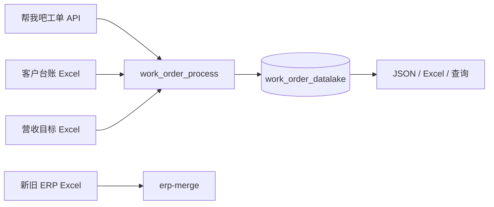

# 项目接手手册实施计划

> **For agentic workers:** REQUIRED SUB-SKILL: Use superpowers:subagent-driven-development (recommended) or superpowers:executing-plans to implement this plan task-by-task. Steps use checkbox (`- [ ]`) syntax for tracking.

**Goal:** 生成一份面向首次接手人员、覆盖当前项目全部命令、模块、顶层类和函数的长期可维护 Markdown 手册。

**Architecture:** 使用 `docs/project_handover_guide.md` 作为统一入口，现有专题文档作为字段和专项规则的权威补充。新增基于 AST 和 CLI 帮助文本的文档覆盖测试，使新命令、新模块、类或顶层函数出现时必须同步更新手册。

**Tech Stack:** Markdown、Mermaid、Python 3.14、pytest、ast、argparse、uv、PowerShell、MySQL 8。

## Global Constraints

- 只生成 Markdown，不生成 Word、PDF 或文档编辑脚本。
- 不扫描或修改 `data/` 和 `output/`。
- 不包含真实 API、MySQL 或 SSH 凭据。
- 不执行 API 拉取、数据库写入、服务器部署或服务重启。
- 命令以当前 `pyproject.toml`、`cli.py` 和 `erp_merge/cli.py` 为准。
- 函数索引覆盖 `src/work_order_process` 下全部模块级类、同步函数和异步函数。
- PowerShell 与 Bash 命令必须使用明确的代码块语言。
- 危险命令必须说明影响范围和执行前检查。

---

### Task 1: 建立手册覆盖测试

**Files:**
- Create: `tests/test_handover_guide.py`
- Create: `docs/project_handover_guide.md`

**Interfaces:**
- Consumes: `src/work_order_process/**/*.py`、`work_order_process --help`、`README.md`
- Produces: 自动检查手册章节、CLI 命令、模块、类和顶层函数覆盖的 pytest 测试

- [ ] **Step 1: 写手册覆盖测试**

创建 `tests/test_handover_guide.py`：

```python
from __future__ import annotations

import ast
import re
import subprocess
import sys
from pathlib import Path


PROJECT_ROOT = Path(__file__).resolve().parents[1]
GUIDE_PATH = PROJECT_ROOT / "docs" / "project_handover_guide.md"
SOURCE_ROOT = PROJECT_ROOT / "src" / "work_order_process"


def _guide_text() -> str:
    return GUIDE_PATH.read_text(encoding="utf-8")


def _cli_commands() -> set[str]:
    result = subprocess.run(
        [sys.executable, "-m", "work_order_process.cli", "--help"],
        cwd=PROJECT_ROOT,
        text=True,
        encoding="utf-8",
        capture_output=True,
        check=True,
    )
    match = re.search(r"\[\{([^}]+)\}\]", result.stdout)
    assert match is not None
    return set(match.group(1).split(","))


def _source_symbols() -> set[str]:
    symbols: set[str] = set()
    for path in SOURCE_ROOT.rglob("*.py"):
        relative = path.relative_to(SOURCE_ROOT).with_suffix("")
        module = ".".join(relative.parts)
        if module == "__init__":
            continue
        symbols.add(f"work_order_process.{module}")
        tree = ast.parse(path.read_text(encoding="utf-8"))
        for node in tree.body:
            if isinstance(
                node,
                (ast.ClassDef, ast.FunctionDef, ast.AsyncFunctionDef),
            ):
                symbols.add(f"work_order_process.{module}.{node.name}")
    return symbols


def test_handover_guide_has_required_sections() -> None:
    text = _guide_text()
    for heading in (
        "快速接手",
        "架构与数据流",
        "配置与依赖",
        "命令参考",
        "模块与函数参考",
        "数据库与业务流程",
        "开发与测试",
        "生产运行",
        "故障排查",
        "维护检查表",
    ):
        assert heading in text


def test_handover_guide_covers_every_cli_command() -> None:
    text = _guide_text()
    missing = sorted(
        command for command in _cli_commands() if f"`{command}`" not in text
    )
    assert not missing, missing


def test_handover_guide_indexes_all_source_symbols() -> None:
    text = _guide_text()
    missing = sorted(
        symbol for symbol in _source_symbols() if f"`{symbol}`" not in text
    )
    assert not missing, missing


def test_readme_links_handover_guide() -> None:
    text = (PROJECT_ROOT / "README.md").read_text(encoding="utf-8")
    assert "[项目接手手册](docs/project_handover_guide.md)" in text
```

- [ ] **Step 2: 创建最小手册占位文件**

创建 `docs/project_handover_guide.md`：

```markdown
# work_order_process 项目接手手册
```

- [ ] **Step 3: 运行测试确认失败**

Run:

```powershell
uv run --all-groups pytest tests/test_handover_guide.py -q
```

Expected: 4 项测试失败，分别指出缺少章节、CLI 命令、源码符号和 README 链接。

- [ ] **Step 4: 提交测试基线**

```powershell
git add tests/test_handover_guide.py docs/project_handover_guide.md
git commit -m "test: define handover guide coverage"
```

### Task 2: 编写快速接手、架构、配置和命令参考

**Files:**
- Modify: `docs/project_handover_guide.md`

**Interfaces:**
- Consumes: `.env.example`、`pyproject.toml`、`config/*`、两个 CLI 的 `--help`
- Produces: 可从零安装和选择命令的前半部分手册

- [ ] **Step 1: 写快速接手和安全边界**

加入：

- 项目目的、技术栈和业务术语。
- `uv sync --all-groups --locked` 安装步骤。
- `.env.example` 到 `.env` 的配置步骤。
- `uv lock --check`、`pytest`、两个 `--help` 的只读验证。
- 第一天禁止执行的 API 批量拉取、数据库写入、删表、服务和凭据操作。

- [ ] **Step 2: 写目录、架构和数据流**

加入当前目录树，并使用 Mermaid 表达：



为工单、客户联系人、ERP、台账、营收和调度数据流补充文字步骤。

- [ ] **Step 3: 写依赖和配置参考**

覆盖：

- Python `>=3.14`、默认依赖、`dev` 和 `erp` 组。
- `.env.example` 全部变量的作用和是否必填。
- `erp_merge_rules.toml`、`time_metrics.json` 和工作日历。
- 本地与生产路径差异。

- [ ] **Step 4: 写全部 CLI 命令矩阵**

逐项记录：

```text
run
monthly-tickets
template-samples
mysql-init
mysql-drop-tables
mysql-create-analysis-views
mysql-import-ticket
mysql-import-month
mysql-import-month-v1
mysql-import-year
mysql-import-customers
mysql-import-contacts
mysql-probe-customers
mysql-probe-contacts
mysql-import-personnel
mysql-add-partitions
mysql-sync-log
import-erp
import-customer-account
generate-revenue-summary
metric-month
metric-ticket
probe
dictionary
```

每项包含用途、参数、PowerShell 示例、依赖、输出、写入行为、幂等性和验证方式。
单独记录 `erp-merge` 的全部参数和从原始 Excel 到数据库文档版的完整示例。

- [ ] **Step 5: 运行阶段测试**

```powershell
uv run --all-groups pytest tests/test_handover_guide.py::test_handover_guide_has_required_sections tests/test_handover_guide.py::test_handover_guide_covers_every_cli_command -q
```

Expected: CLI 覆盖测试通过；函数索引和 README 链接测试仍失败。

- [ ] **Step 6: 提交前半部分手册**

```powershell
git add docs/project_handover_guide.md
git commit -m "docs: add onboarding architecture and command guide"
```

### Task 3: 编写模块、类和函数参考

**Files:**
- Modify: `docs/project_handover_guide.md`

**Interfaces:**
- Consumes: `src/work_order_process/**/*.py`
- Produces: 与 AST 覆盖测试一致的源码导航和函数参考

- [ ] **Step 1: 建立模块职责总表**

为每个模块记录：

```text
模块全名 | 职责 | 主要依赖 | 外部副作用 | 主要调用者
```

覆盖根包全部模块和 `erp_merge` 子包。

- [ ] **Step 2: 写入口和核心业务函数详解**

详细说明：

- `cli.main` 和 `erp_merge.cli.main`。
- `WorkOrderClient` 及主要 API 方法。
- 工单导出、解析和 MySQL 入库。
- 客户联系人同步和历史版本。
- ERP 合并、清洗、分摊、临时表校验和原子发布。
- 台账导入。
- 营收目标读取、指标聚合、整月替换和 Excel 输出。
- 时间指标、调度器和备份入口。

条目格式：

```markdown
#### `work_order_process.module.function`

- 签名：`function(...) -> ...`
- 职责：
- 输入与输出：
- 副作用：
- 异常：
- 调用关系：
```

- [ ] **Step 3: 写全部其他顶层符号索引**

使用以下命令生成核对清单：

```powershell
rg -n "^(class|def|async def) [A-Za-z_][A-Za-z0-9_]*" src/work_order_process -g "*.py"
```

每个符号使用完整限定名，例如：

```markdown
- `work_order_process.revenue_summary._growth_rate`：计算同比增长率，去年同期为零时返回 `None`。
```

- [ ] **Step 4: 运行源码符号覆盖测试**

```powershell
uv run --all-groups pytest tests/test_handover_guide.py::test_handover_guide_indexes_all_source_symbols -q
```

Expected: PASS。

- [ ] **Step 5: 提交函数参考**

```powershell
git add docs/project_handover_guide.md
git commit -m "docs: add complete module and function reference"
```

### Task 4: 编写数据库、业务流程、开发、生产和排障章节

**Files:**
- Modify: `docs/project_handover_guide.md`
- Modify: `README.md`

**Interfaces:**
- Consumes: `sql/*.sql`、`mysql_storage.py`、`daily_runner.py`、`deploy/*`、现有专题文档
- Produces: 完整操作闭环和 README 入口

- [ ] **Step 1: 写数据库与业务流程**

覆盖：

- 全部数据域和关键表。
- 主键、分区、快照和逻辑关联。
- ERP 九个年度分摊字段和倒签调整。
- 月度营收四组指标。
- 常用核对 SQL 及专题文档链接。

- [ ] **Step 2: 写开发、测试和 CI**

说明：

```powershell
uv sync --all-groups --locked
uv lock --check
uv run --all-groups pytest -q
uv run --all-groups python -m compileall -q src merge_erp_data.py main.py
git diff --check
```

补充测试文件与模块对应关系、提交前检查和 CI 工作流。

- [ ] **Step 3: 写生产运行和发布**

覆盖：

- `daily_runner` 三类任务。
- systemd、logrotate 和备份 timer。
- 发布前、发布中、发布后的步骤。
- 只读验收、回滚原则和不得自动执行的外部操作。

- [ ] **Step 4: 写故障排查和维护矩阵**

按症状组织：

- API 认证、HTTP 和 JSON。
- MySQL 连接、权限、分区和事务。
- Excel 表头、公式、日期和数值。
- ERP 快照、营收全零保护和平台映射。
- APScheduler、systemd、日志和备份。

最后加入代码变更到文档章节的维护矩阵。

- [ ] **Step 5: 更新 README 入口**

在项目文档列表首位加入：

```markdown
- [项目接手手册](docs/project_handover_guide.md)
```

- [ ] **Step 6: 运行手册覆盖测试**

```powershell
uv run --all-groups pytest tests/test_handover_guide.py -q
```

Expected: 4 passed。

- [ ] **Step 7: 提交完整手册**

```powershell
git add README.md docs/project_handover_guide.md
git commit -m "docs: complete project handover handbook"
```

### Task 5: 完整验证和人工抽查

**Files:**
- Modify when necessary: `docs/project_handover_guide.md`
- Modify when necessary: `tests/test_handover_guide.py`

**Interfaces:**
- Consumes: 完整仓库
- Produces: 可交付、可维护且通过测试的手册

- [ ] **Step 1: 核对 CLI**

```powershell
uv run --all-groups work_order_process --help
uv run --all-groups erp-merge --help
```

Expected: 手册中的子命令和参数与帮助文本一致。

- [ ] **Step 2: 检查文档链接和安全规则**

```powershell
uv run --no-default-groups pytest tests/test_repository_security.py tests/test_handover_guide.py -q
```

Expected: 全部通过。

- [ ] **Step 3: 运行完整验证**

```powershell
uv sync --all-groups --locked
uv lock --check
uv run --all-groups pytest -q
uv run --all-groups python -m compileall -q src merge_erp_data.py main.py
git diff --check
```

Expected: 命令全部返回 0。

- [ ] **Step 4: 人工抽查**

检查：

- Mermaid 语法块闭合。
- PowerShell 和 Bash 命令块标记正确。
- 无真实凭据、生产数据量和临时绝对文件名。
- 写库和危险命令均有风险提示。
- 专题文档链接均存在。
- `data/` 下未跟踪文件未被提交。

- [ ] **Step 5: 提交验证修正**

仅在验证产生修正时执行：

```powershell
git add docs/project_handover_guide.md tests/test_handover_guide.py README.md
git commit -m "docs: verify project handover handbook"
```
